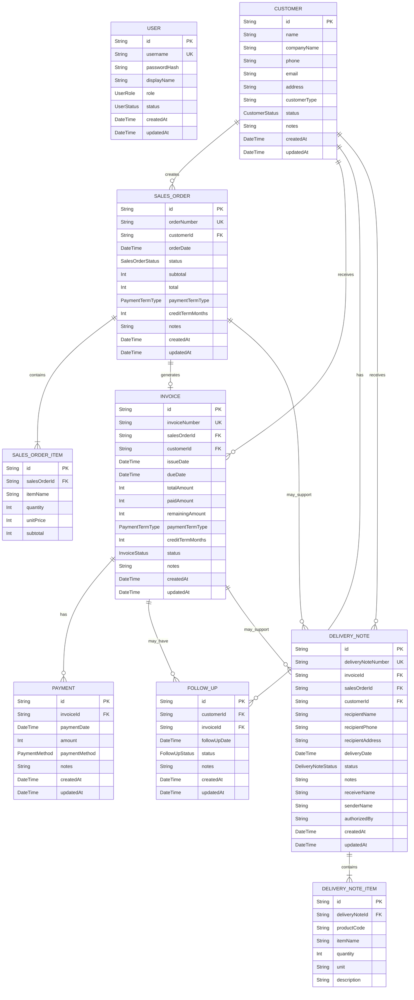

# ERD - CV Tajuk Revenue Cycle Information System

This ERD represents the current MVP database structure based on the actual Prisma schema in `prisma/schema.prisma`.

The system uses SQLite through Prisma. The diagram below shows the physical database models and relationships that are currently implemented in the project. Some business concepts, such as Receivables, are used in the application flow but are derived from existing tables instead of stored as their own physical table.

## Mermaid ERD Diagram

## Entity Summary

| Entity | Purpose |
| --- | --- |
| User | Stores local MVP login/account data, including role and account status. |
| Customer | Stores customer master data used by Sales Orders, Invoices, Follow-ups, and Surat Jalan. |
| SalesOrder | Stores the main customer order, payment term, total amount, and order status. |
| SalesOrderItem | Stores item lines for one Sales Order. |
| Invoice | Stores invoice document data generated from a Sales Order, including due date, paid amount, remaining amount, payment term, and invoice status. |
| Payment | Stores payment records against an Invoice. |
| FollowUp | Stores customer reminder activities, optionally linked to an Invoice. |
| DeliveryNote | Stores Surat Jalan / delivery note header data, optionally linked to an Invoice and/or Sales Order. |
| DeliveryNoteItem | Stores item lines for one Surat Jalan / Delivery Note. |

## Physical Relationship Notes

- One Customer can have many Sales Orders.
- One Sales Order can have many Sales Order Items.
- One Sales Order can have zero or one Invoice. In the Prisma schema, `Invoice.salesOrderId` is unique, so one Sales Order cannot have more than one Invoice.
- One Customer can have many Invoices.
- One Invoice can have many Payments.
- One Customer can have many Follow-ups.
- A Follow-up must belong to a Customer, but it may or may not be connected to an Invoice.
- One Customer can have many Delivery Notes.
- A Delivery Note may be connected to an Invoice and/or a Sales Order.
- One Delivery Note can have many Delivery Note Items.
- User currently has no physical relationship to transaction tables in the Prisma schema.

## Logical Relationship Notes

- Receivables are not stored as a separate physical `Receivable` model in the current Prisma schema. In the MVP, receivables are calculated from `Invoice.remainingAmount`, `Invoice.status`, and `Invoice.dueDate`.
- Follow-ups can support receivable collection because a Follow-up may link to an Invoice with an open remaining amount. However, there is no separate `Receivable` table or direct `Receivable -> FollowUp` database relation.
- The Dashboard uses Sales Order, Invoice, Payment, Delivery Note, and Follow-up records to show business insight, but it does not have its own dashboard table.
- Surat Jalan is implemented physically as the `DeliveryNote` model.
- The User / Account model is used for local demo login and settings, but it is not linked to created transactions.
- No HistoryLog or AuditLog model is present in the current Prisma schema, so history/audit logging is not part of this ERD.
