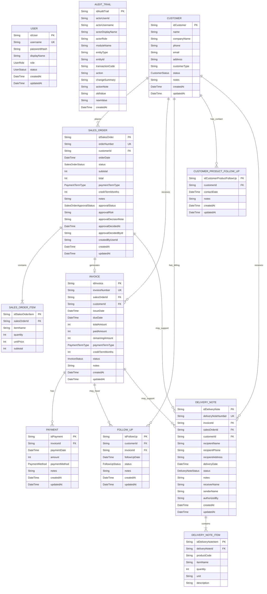

# ERD - CV Tajuk Revenue Cycle Information System

Updated: 22 June 2026

This ERD reflects the active Prisma schema and the camelCase physical database naming currently applied by the migrations. Every physical primary key begins with `id` followed by its entity name, such as `idCustomer`, `idSalesOrder`, and `idInvoice`. Prisma maps these physical names to its stable application-facing `id` fields.

## Mermaid ERD

## Entity Summary

| Entity | Primary key | Purpose |
| --- | --- | --- |
| User | `idUser` | Local account, role, login status, and authorization identity. |
| AuditTrail | `idAuditTrail` | Immutable activity evidence including actor, action, confirmation note, and old/new values. |
| Customer | `idCustomer` | Customer master data, active/inactive state, and notes. |
| SalesOrder | `idSalesOrder` | Revenue-cycle starting document, payment terms, totals, approval state, and notes. |
| SalesOrderItem | `idSalesOrderItem` | Product or service lines belonging to a Sales Order. |
| Invoice | `idInvoice` | Billing document generated from one Sales Order. |
| Payment | `idPayment` | Partial or full payment recorded against an Invoice. |
| FollowUp | `idFollowUp` | Billing/collection activity linked to a Customer and optionally an Invoice. |
| CustomerProductFollowUp | `idCustomerProductFollowUp` | Product/contact activity for maintaining the customer relationship. |
| DeliveryNote | `idDeliveryNote` | Surat Jalan header linked to a Customer and optionally an Invoice/Sales Order. |
| DeliveryNoteItem | `idDeliveryNoteItem` | Product lines contained in a Surat Jalan. |

## Relationship and Deletion Rules

- One Customer can have many Sales Orders, Invoices, Billing Follow-ups, Product Follow-ups, and Delivery Notes.
- One Sales Order contains many Sales Order Items and can generate at most one Invoice.
- One Invoice can have many Payments, Billing Follow-ups, and Delivery Notes.
- One Delivery Note contains many Delivery Note Items.
- Sales Order Items, Payments, Customer Product Follow-ups, and Delivery Note Items use cascade behavior where configured in Prisma.
- Deleting an eligible ongoing Sales Order is an application transaction that explicitly removes its Delivery Notes, Billing Follow-ups, Payments, Invoice, Sales Order Items, and Sales Order. The Customer and Audit Trail remain.
- Paid, delivered, or cancelled transaction chains are protected from Sales Order deletion.

## Logical Concepts

- Receivable is derived from `Invoice.remainingAmount`, `Invoice.status`, and `Invoice.dueDate`; there is no separate Receivable table.
- Dashboard values and charts are calculated from operational entities and do not require a Dashboard table.
- `actorUserId`, `createdByUserId`, and `approvalDecidedById` are stored as trace values but are not declared as Prisma foreign-key relations in the current MVP.
- Audit Trail records retain deletion evidence and the required deletion confirmation note after the operational record has been removed.

## Naming Notes

- Physical attributes use camelCase.
- Every active table uses a descriptive camelCase primary key beginning with `id`.
- `HistoryLog` is a legacy physical table retained by earlier migrations; the active application uses `AuditTrail` instead.
