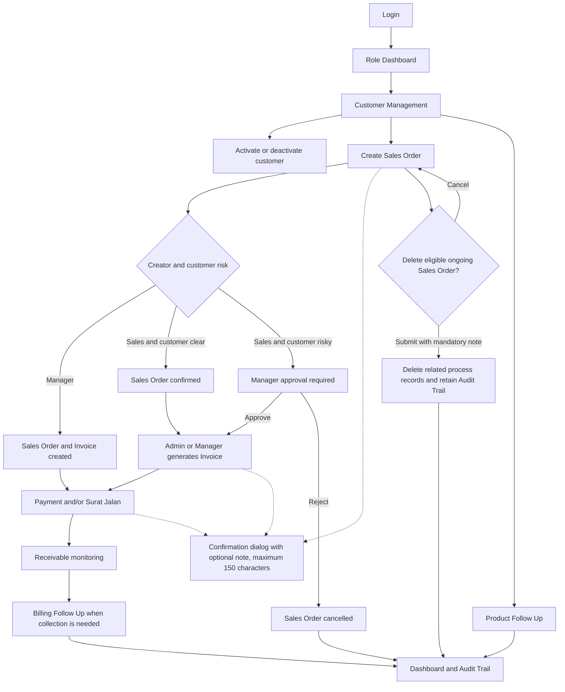

# CV Tajuk Revenue Cycle MVP - Complete User Flows

Updated: 22 June 2026

This revision reflects the current responsive layout, role-specific dashboards,
Manager Sales Order approval, transaction confirmation dialogs, confirmation
notes, cascading ongoing-order deletion, customer activation controls, table
pagination/search/filter/sort behavior, expandable comments, and the latest role restrictions.

## 1. Main System Flow



Admin users can view Sales Orders but cannot create them. Every operational create, update, approval, invoice, payment, delivery, and status action first opens a confirmation dialog. The user can Cancel or Submit. A confirmation note is optional for normal actions and mandatory for deletion.

## 2. Roles

| Role | Main responsibility | Special flow |
|---|---|---|
| Manager | Monitor the complete revenue cycle and business insights | Can view and use every current feature, approve or reject risky Sales Orders, and review popular products |
| Admin | Manage invoicing, delivery documents, receivables, payments, Billing, and accounts | Cannot create Sales Orders; Audit Trail is for reviewing automatically generated records |
| Sales | Manage customers, create Sales Orders, and maintain customer relationships | Cannot create Invoices, Payments, Surat Jalan, or accounts |

The application identity area shows the current role beside **CV Tajuk / Revenue
Cycle MVP**. Every role can open and inspect every module. Restricted fields and
buttons remain visible but disabled; hovering them shows which role is allowed to
use the action.

### Role Action Matrix

| Action | Manager | Admin | Sales |
|---|:---:|:---:|:---:|
| View dashboards and operational modules | Yes | Yes | Yes |
| Manage customer records | Yes | Yes | Yes |
| Create Sales Order | Yes | No | Yes |
| Delete eligible ongoing Sales Order | Yes | Yes | No |
| Approve or reject risky Sales Order | Yes | No | No |
| Generate Invoice | Yes | Yes | No |
| Record Payment | Yes | Yes | No |
| Create Surat Jalan | Yes | Yes | No |
| Manage Billing and product Follow Up | Yes | Yes | Yes |
| Review Audit Trail | Yes | Yes | Yes |
| Create user account | Yes | Yes | No |

## 3. Login, Navigation, and Logout

### Login

1. Open the application.
2. Enter an active username and password.
3. If needed, select the eye icon to show or hide the password text.
4. Select **Login**.
5. The system validates the account.
6. A valid user is redirected to the dashboard for their role.
7. Invalid credentials show an error and keep the user on the Login page.

### Navigation

1. On a desktop screen, use the left sidebar to open Dashboard, Customers, Sales Orders, Invoices, Payments, Surat Jalan, Receivables, Billing, Follow Up, Audit Trail, or Settings.
2. On a smaller screen, use the horizontally scrollable navigation row at the top of the page.
3. The active module is highlighted in the navigation.
4. Check the role badge beside the CV Tajuk identity when confirming which role is active.
5. Select the fixed Help button for guidance about the current page.
6. Select the fixed notification button to review role-specific reminders.

### Logout

1. Select **Logout** at the bottom of the desktop sidebar or at the end of the mobile navigation row.
2. The session ends.
3. The user returns to the Login page.

### Responsive Layout Flow

1. Open any module on desktop, tablet, or mobile.
2. Page headings and primary actions stack vertically when horizontal space is limited.
3. Cards change from multi-column grids to fewer columns or a single column.
4. Wide tables remain inside a horizontal scrolling area instead of stretching the page.
5. Process tabs can scroll horizontally on narrow screens.
6. Help and Notification buttons reduce to icon buttons on small screens to avoid covering content.
7. Help and Notification panels stay within the visible screen and scroll internally when their content is long.

## 4. Dashboard Flows

### Manager Dashboard

1. Login as Manager.
2. Review Total Sales Value, Paid Amount, Outstanding Receivables, and items needing attention.
3. Review Revenue Trend, Revenue Composition, Sales Order Status, and Invoice Status.
4. Review the **Top 5 Popular Products** horizontal chart ranked by confirmed quantity sold.
5. Open a Recent Sales Order to see its complete transaction detail.
6. Review Billing reminders and module totals.
7. Search customer overdue-payment and category insights.
8. Use the notification button to open pending Sales Order approvals, then continue to the **Need Approval** tab.

### Admin Dashboard

1. Login as Admin.
2. Review Open Invoices, Overdue Receivables, Surat Jalan Needed, and Planned Billing counts.
3. Review Invoice Insight.
4. Open a transaction from **Surat Jalan to Create** when delivery documentation is needed.
5. Review incoming due receivables; if none are approaching, review other unpaid receivables.
6. Open a Billing task requiring action.
7. Review the compact Recent Sales Orders list.
8. Use notifications to open Billing work whose deadline is near or overdue.

### Sales Dashboard

1. Login as Sales.
2. Review Total Sales Value, Paid Amount, Outstanding Receivables, and attention count.
3. Review revenue and transaction-status charts.
4. Search customers with overdue payments.
5. Search the customer category list.
6. Use the displayed category and recommended markup when preparing a Sales Order.
7. Open Follow Up reminders for customers with no transaction in three months.
8. Sales does not see the Manager-only Popular Products chart.

## 5. Notification Flow

1. A small orange dot appears on the notification button when unread items exist.
2. Select the notification button.
3. Review the notification title, description, and sent date.
4. Opening the panel marks its current notifications as read for that user.
5. Select a notification to open the related work page.

Role-specific notification destinations:

- Manager: pending Sales Order -> **Sales Orders / Need Approval**.
- Admin: near or overdue Billing task -> **Billing**.
- Sales: customer inactive for three months -> **Follow Up**.

## 6. Customer Management Flows

### Add Customer

1. Open **Customers**.
2. Select **Add Customer**.
3. Enter company, contact, phone, email, address, customer type, status, and optional notes.
4. Save the customer.
5. The customer becomes available for Sales Orders and related transactions when Active.

### Search and Review Customers

1. Open **Customers**.
2. Enter a company or contact name in Search.
3. Review Customer Category and Payment Risk in the result row.
4. Select View to open the customer detail.

### Edit Customer

1. Find the customer in the Customer list.
2. Select Edit.
3. Change the required information or Active/Inactive status.
4. Save the changes.
5. The change is recorded in the Audit Trail.

### Customer Category Flow

The system calculates category from recent Sales Order activity:

- New: customer was added less than one month ago -> recommended markup 0%.
- Loyal: more than three transactions per month -> recommended markup 0%.
- Normal: approximately one transaction per month -> recommended markup 5%.
- Occasional: less than one transaction per month -> recommended markup 10-15%.

### Customer Payment-Risk Flow

The system calculates payment risk from invoice due dates and payment history:

- Late Payment: the customer currently has an overdue unpaid balance.
- Historically Late: the customer previously paid after an invoice due date.
- Clean: no detected current or historical late payment.

### Customer Detail and Transaction History

1. Open a customer.
2. Review the Customer Category card.
3. Review the Customer Payment Risk card.
4. Review all linked transactions: Order Number, Order Date, Payment Term, Sales Order Status, Invoice, Surat Jalan, and Total.
5. Select **Make Inactive** or **Make Active** to change whether the customer is available for new Sales Orders and Follow-ups.
6. Review the confirmation dialog, add an optional note of up to 150 characters, and Submit or Cancel.
7. Select the transaction action to open the full Sales Order detail.

## 7. Sales Order Flows

### Create Sales Order

1. Open **Sales Orders**.
2. Stay on **Ongoing Process**.
3. Select **Create Sales Order**.
4. Select an active customer.
5. Choose Debit or Credit; for Credit, select a term from 1 to 12 months.
6. Add one or more item names, quantities, and unit prices.
7. Add optional notes.
8. Review the calculated total.
9. Select **Create Sales Order**.
10. Review the confirmation dialog. Add an optional confirmation note of up to 150 characters, then Submit or Cancel.
11. The system checks the creator's role and the customer's payment risk.

### Sales-Created Clean Customer Branch

This branch is used when Sales creates an order for a Clean customer.

1. The Sales Order is created.
2. The Sales Order status becomes Confirmed.
3. No Invoice is generated by Sales.
4. Admin or Manager opens the Sales Order and selects Generate Invoice.
5. The Invoice, Receivable, and any Credit Billing reminder are created.

### Manager-Created Sales Order Branch

1. Manager creates the Sales Order.
2. The Invoice is generated automatically.
3. The Sales Order becomes Invoiced.
4. The Receivable and any Credit Billing reminder are created.

Admin can view Sales Orders but its Create Sales Order button and direct-entry form are disabled.

### Risky Customer Approval Branch

This branch is used when Sales creates an order for a Late Payment or Historically Late customer.

1. The Sales Order is saved as Draft with approval status Pending.
2. No Invoice, Receivable, or Billing task is created yet.
3. The order appears in **Need Approval**.
4. The Manager receives an unread notification.
5. Sales can review the pending order but cannot decide it.

Manager decision:

1. Login as Manager.
2. Open the notification or open **Sales Orders**.
3. Select **Need Approval**, located before Ongoing Process.
4. Select the pending order to review customer, payment risk, payment term, items, quantities, prices, and total.
5. Enter an optional decision note.
6. Select **Approve** or **Reject**.

If approved:

1. Approval status becomes Approved.
2. The Invoice is generated.
3. The Sales Order becomes Invoiced.
4. The Receivable and any required Credit Billing reminder are created.
5. The order continues through the normal revenue cycle.

If rejected:

1. Approval status becomes Rejected.
2. The Sales Order becomes Cancelled.
3. No Invoice can be generated.
4. The rejection and optional note remain in the Audit Trail and order detail.

### Sales Order Tabs and Detail

1. Use **Need Approval** for pending Manager decisions.
2. Use **Ongoing Process** for active orders.
3. Use **Done Process** for shipped or cancelled orders.
4. Select View to open the complete transaction detail.
5. Review customer, items, Invoice, Payments, Surat Jalan, Receivable, and Billing progress.
6. A pending or rejected approval cannot bypass the Invoice restriction.

### Delete an Ongoing Sales Order

1. Open the full detail of an ongoing Sales Order.
2. The Delete button is available only to Admin and Manager when the transaction is not paid, delivered, or cancelled.
3. Select **Delete Sales Order**.
4. The confirmation dialog lists the affected transaction and related records.
5. Enter a mandatory deletion note of up to 150 characters.
6. Select Submit to delete, or Cancel to keep the complete transaction.
7. The system removes related Delivery Notes and items, Billing Follow-ups, Payments, Invoice, Sales Order Items, and Sales Order in one transaction.
8. The Customer remains active in master data.
9. Audit Trail retains the deletion action, actor, record summary, and mandatory confirmation note.

### Download Sales Order Excel Data

1. Open **Sales Orders**.
2. Select **Download Sales Order Data**.
3. Choose a Start Date and End Date from the calendar fields.
4. Confirm the download.
5. The system downloads an `.xlsx` workbook.
6. Open **Summary** for order-level data or **Items** for item-level data.

## 8. Invoice Flows

### Review Invoice

1. Open **Invoices**.
2. Use Ongoing Process for Unpaid, Partial, or Overdue invoices.
3. Use Done Process for Paid or Cancelled invoices.
4. Select an Invoice to review customer, Sales Order, issue date, due date, payment term, totals, remaining balance, and status.

### Generate Invoice from an Existing Eligible Sales Order

1. Open an eligible Sales Order without an Invoice.
2. Select **Generate Invoice**.
3. Review the confirmation dialog and optionally enter a note of up to 150 characters.
4. Submit or Cancel the action.
5. The system checks that approval is Not Required or Approved.
6. The Invoice and Receivable are created.
7. For Credit, the Billing reminder is created.

### Print Invoice

1. Open an Invoice.
2. Select **View / Print Invoice**.
3. Review the printable document.
4. Use the browser Print action to print or save it as PDF.

## 9. Payment Flow

1. Open **Payments**.
2. Review the Payment Queue of Unpaid, Partial, and Overdue invoices.
3. Select **Record Payment** on an Invoice.
4. Enter payment date, amount, method, and optional note/reference.
5. Select Record Payment, review the confirmation dialog, and optionally add a note of up to 150 characters.
6. Submit or Cancel the payment.
7. The system prevents payment above the remaining balance.
8. Paid Amount and Remaining Amount update automatically.
9. Invoice status becomes Partial or Paid as appropriate.
10. A fully paid Receivable moves to Done Process.
11. Review the payment and confirmation note in Recorded Payments and the Sales Order detail.

## 10. Surat Jalan Flows

### Start Surat Jalan

1. Open **Surat Jalan** and select Add, or start from an eligible Invoice or Payment row.
2. Select the Invoice, Sales Order, or Customer.
3. When linked data exists, review the copied recipient and item information.
4. Enter delivery date, recipient, phone, address, sender, authorized person, items, and optional notes.
5. Select Save, review the confirmation dialog, and optionally add a note of up to 150 characters.
6. Submit or Cancel the Surat Jalan.

Eligibility rules:

- Debit: the Invoice must be Paid before Surat Jalan can be created.
- Credit: Surat Jalan can be created after Invoice generation, before full payment.

### Manage and Print Surat Jalan

1. Use Ongoing Process for Draft or Issued documents.
2. Use Done Process for Delivered or Cancelled documents.
3. Open a document to review its detail.
4. Update the status when delivery progresses.
5. Select Print to print or save the Surat Jalan as PDF.

## 11. Receivable Flow

1. Open **Receivables**.
2. Review Active Receivables and the total Remaining Amount.
3. Use Ongoing Process for balances still owed.
4. Filter Ongoing records by Unpaid, Partial, or Overdue.
5. Use Done Process for Paid or Cancelled records.
6. The list shows Remaining Amount but keeps Total and Paid Amount in the full Sales Order detail.
7. Select **View Sales Order** to inspect the full source transaction and its Total/Paid values.
8. Select **Create Billing** when collection work is needed.
9. Customer payment risk updates automatically from overdue and payment history.

Receivables are calculated from Invoices and Payments; users do not manually create a Receivable record.

## 12. Billing Flow

1. Open **Billing**, or select Create Billing from a Receivable.
2. If opened from a Receivable, confirm the preselected Customer and Invoice.
3. Enter the follow-up date/deadline, status, and collection note.
4. Select Save, review the confirmation dialog, and optionally add a note of up to 150 characters.
5. Submit or Cancel the Billing task.
6. Use Ongoing Process for Planned tasks.
7. Use Done Process for Done or Cancelled tasks.
8. Admin sees near or overdue Billing work on the dashboard and in notifications.
9. Open the task from the notification and use its customer, Invoice, deadline, and notes to perform the collection activity.

## 13. Product Follow Up Flow

1. Open **Follow Up**.
2. Search for a customer.
3. Review the latest contact date or identify customers never contacted.
4. Sales receives a reminder when an active customer has no transaction for three months.
5. Open the reminder to preselect the customer.
6. Selecting Record Contact from any customer row also scrolls to the form and automatically selects that customer.
7. Enter the contact date and an optional note about new products or the conversation.
8. Select Save, review the confirmation dialog, and optionally add a note of up to 150 characters.
9. Submit or Cancel the Follow Up.
10. The latest-contact information and Audit Trail update.

## 14. Table Search, Sort, and Filter Flow

1. Open any operational page containing a table.
2. Use the single **Search** box to show rows containing the entered text in any column; no field selection is required.
3. Select the sort icon beside a column heading to sort ascending.
4. Select it again to sort descending.
5. A funnel appears only on date columns or columns with frequently repeated values; select it to the right of the sort icon.
6. Search the values inside the popup, select one or more checkboxes, and choose **Apply Filter**.
7. For a date column, open its funnel, enter Start Date, End Date, or both, then select **Start Filter**.
8. Use **Clear** inside a popup to remove that column's filter.
9. Search and filters evaluate the complete result set, not only the current page.
10. Tables show 10 matching rows per page. Use the centered Previous and Next controls to move between pages.
11. Review the **Showing X-Y of Z** result count and current page number.
12. Select **Reset** beside the simple search bar to clear every filter, return to page 1, and restore the original row order.
13. Long plain-text and Notes cells are limited to two lines. Select the subtle **Show more** link to expand a row, then **Show less** to collapse it.
14. On a narrow screen, the search fills the available width while the result count and Reset action move below it.

Sorting and filtering are excluded from printable Invoice and Surat Jalan document views.

Product Follow Up is for sales relationship activity. Billing is a separate collection workflow.

## 15. Audit Trail Flow

1. Open **Audit Trail**.
2. Review who performed an action, their role, the module, transaction code, action, confirmation note, summary, and time.
3. Filter by date, module, action, transaction, or user.
4. Use the trail to verify Customer, Sales Order, approval, Invoice, Payment, Surat Jalan, Billing, and Follow Up activity.
5. Compare old and new values when change detail is available.
6. Deletion evidence remains in Audit Trail even after the operational Sales Order chain is removed.

## 16. Account Settings Flow

1. Open **Settings**.
2. Enter Username, Display Name, Password, Role, and Active/Inactive status.
3. Select **Save Account** and review the confirmation dialog.
4. Add an optional note of up to 150 characters, then Submit or Cancel.
5. Review the new account in Existing Accounts.
6. An Active account can log in and receives the dashboard, notifications, and approval capability associated with its role.

This MVP supports creating and listing local demo accounts. It does not currently provide account editing, password reset, or advanced permission administration.

Sales can inspect Settings and existing accounts, but all account-creation fields and the Save Account button are disabled.

## 17. Help and Printable Documents

### Page Help

1. Open any main page.
2. Select **Help**.
3. Read guidance relevant to that module.
4. Close Help and continue the task.

### Card Information Tooltips

1. Every primary card has a visible title.
2. Hover or focus the **i** icon beside the title.
3. Read the tooltip explaining what the card is used for.
4. Move away or remove focus to close the tooltip.

### Printable Documents

1. Open an Invoice or Surat Jalan with a print action.
2. Open its printable view.
3. Check the business and transaction information.
4. Use the browser Print action to print or save as PDF.

## 18. End-to-End Business Scenarios

### Clean Debit Customer

```text
Customer -> Sales Order -> Invoice -> Full Payment -> Surat Jalan -> Completed
```

### Clean Credit Customer

```text
Customer -> Sales Order -> Invoice -> Surat Jalan -> Receivable
         -> Billing when needed -> Payment -> Completed
```

### Risky Customer Created by Sales

```text
Customer with Late/Historical Late risk
  -> Sales creates Sales Order
  -> Need Approval + Manager notification
      -> Approve -> Invoice -> normal Debit/Credit flow
      -> Reject  -> Cancelled Sales Order, no Invoice
```

### Inactive Customer Relationship

```text
No transaction for 3 months
  -> Sales notification
  -> Follow Up page
  -> Record contact date and optional note
```

### Overdue Collection

```text
Invoice reaches due date with remaining balance
  -> Overdue Receivable
  -> Customer becomes Late Payment risk
  -> Billing task and Admin reminder
  -> Record Payment
  -> Receivable closes when fully paid
```

## 19. Role Limitation Flow

### Manager

1. Open any module.
2. All current action fields and buttons are enabled.
3. Manager can create Sales Orders, generate Invoices, record Payments, create Surat Jalan, create accounts, and decide approvals.
4. Manager is the only role that can approve or reject a Sales Order in **Need Approval**.

### Sales

1. Open any module and inspect all records.
2. Sales Order creation remains enabled.
3. Generate Invoice, Record Payment, Create Surat Jalan, and Save Account controls appear disabled.
4. Hover a disabled control to see that Admin or Manager access is required.
5. Clean Sales Orders remain Confirmed until Admin or Manager generates the Invoice.
6. Risky Sales Orders remain Pending until Manager approval.
7. Sales can still open Invoice, Payment, Surat Jalan, Settings, and Audit Trail pages for review; only restricted creation actions are disabled.

### Admin

1. Open any module and inspect all records.
2. Invoice, Payment, Surat Jalan, Billing, and account actions remain enabled.
3. Create Sales Order fields and buttons appear disabled.
4. Hover the disabled control to see that Sales or Manager access is required.
5. Audit Trail can be searched and reviewed; its records are generated automatically by system activity rather than through a manual Create action.
6. Admin cannot approve or reject Sales Orders in **Need Approval**.
