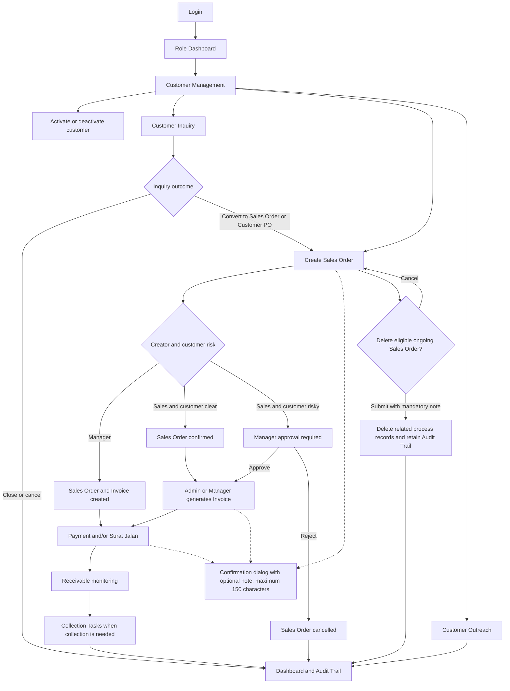
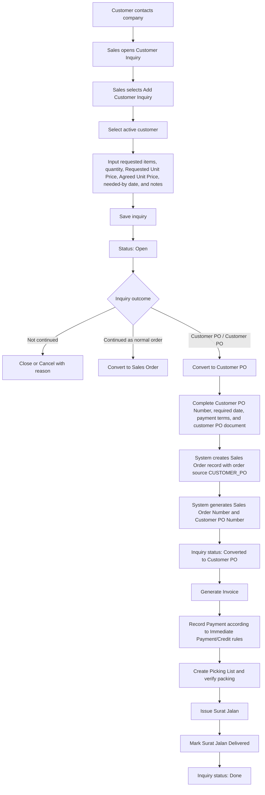

# CV Tajuk Revenue Cycle Information System - Complete User Flows

Updated: 19 July 2026

This revision reflects the current responsive layout, role-specific dashboards,
Manager Sales Order approval, transaction confirmation dialogs, confirmation
notes, cascading ongoing-order deletion, customer activation controls, table
pagination/search/filter/sort behavior, expandable comments, the latest role restrictions,
Customer Inquiry, Customer PO conversion, Customer PO Numbers, inquiry completion after delivery, and the Vercel/Supabase deployment path.

## 1. Main System Flow


```mermaid
flowchart TD
    A["Login"] --> B["Role Dashboard"]
    B --> C["Customer Management"]
    C --> C1["Activate or deactivate customer"]
    C --> CI["Customer Inquiry"]
    CI --> CI1{"Inquiry outcome"}
    CI1 -->|"Close or cancel"| O["Dashboard and Audit Trail"]
    CI1 -->|"Convert to Sales Order or Customer PO"| D
    C --> D["Create Sales Order"]
    D --> E{"Creator and customer risk"}
    E -->|"Manager"| F["Sales Order and Invoice created"]
    E -->|"Sales and customer clear"| G["Sales Order confirmed"]
    G --> H["Admin or Manager generates Invoice"]
    E -->|"Sales and customer risky"| I["Manager approval required"]
    I -->|"Approve"| H
    I -->|"Reject"| J["Sales Order cancelled"]
    F --> K["Payment and/or Surat Jalan"]
    H --> K
    K --> L["Receivable monitoring"]
    L --> M["Collection Tasks when collection is needed"]
    C --> N["Customer Outreach"]
    J --> O["Dashboard and Audit Trail"]
    M --> O
    N --> O
    D -.-> P["Confirmation dialog with optional note, maximum 150 characters"]
    H -.-> P
    K -.-> P
    D --> Q{"Delete eligible ongoing Sales Order?"}
    Q -->|"Cancel"| D
    Q -->|"Submit with mandatory note"| R["Delete related process records and retain Audit Trail"]
    R --> O
```

Admin users can view Sales Orders but cannot create them. Every operational create, update, approval, invoice, payment, delivery, and status action first opens a confirmation dialog. The user can Cancel or Submit. A confirmation note is optional for normal actions and mandatory for deletion.

## 2. Roles

| Role | Main responsibility | Special flow |
|---|---|---|
| Manager | Monitor the complete revenue cycle and business insights | Can view and use every current feature, approve or reject risky Sales Orders, and review popular products |
| Admin | Manage invoicing, delivery documents, receivables, payments, Collections, and accounts | Cannot create Sales Orders; Audit Trail is for reviewing automatically generated records |
| Sales | Manage customers, create Sales Orders, and maintain customer relationships | Cannot create Invoices, Payments, Surat Jalan, or accounts |

The application identity area shows the current role beside **CV Tajuk / Revenue
Cycle system**. Every role can open and inspect every module. Restricted fields and
buttons remain visible but disabled; hovering them shows which role is allowed to
use the action.

### Role Action Matrix

| Action | Manager | Admin | Sales |
|---|:---:|:---:|:---:|
| View dashboards and operational modules | Yes | Yes | Yes |
| Manage customer records | Yes | Yes | Yes |
| Create Customer Inquiry | Yes | No | Yes |
| Create Sales Order or Customer PO | Yes | No | Yes |
| Delete eligible ongoing Sales Order | Yes | Yes | No |
| Approve or reject risky Sales Order | Yes | No | No |
| Generate Invoice | Yes | Yes | No |
| Record Payment | Yes | Yes | No |
| Create Surat Jalan | Yes | Yes | No |
| Manage Collections and Customer Outreach | Yes | Yes | Yes |
| Review Audit Trail | Yes | Yes | Yes |
| Create user account | Yes | Yes | No |

## 3. Login, Navigation, and Logout

### Login

1. Open the application.
2. Enter an active username and password.
3. If needed, select the eye icon to show or hide the password text.
4. Select **Login**.
5. The system validates the account.
6. A valid user is redirected to the dashboard for their role.
7. Invalid credentials show an error and keep the user on the Login page.

### Navigation

1. On a desktop screen, use the left sidebar to open Dashboard, Customers, Sales Orders, Invoices, Payments, Surat Jalan, Receivables, Collections, Customer Outreach, Audit Trail, or Settings.
2. On a smaller screen, use the horizontally scrollable navigation row at the top of the page.
3. The active module is highlighted in the navigation.
4. Check the role badge beside the CV Tajuk identity when confirming which role is active.
5. Select the fixed Help button for guidance about the current page.
6. Select the fixed notification button to review role-specific reminders.

### Logout

1. Select **Logout** at the bottom of the desktop sidebar or at the end of the mobile navigation row.
2. The session ends.
3. The user returns to the Login page.

### Responsive Layout Flow

1. Open any module on desktop, tablet, or mobile.
2. Page headings and primary actions stack vertically when horizontal space is limited.
3. Cards change from multi-column grids to fewer columns or a single column.
4. Wide tables remain inside a horizontal scrolling area instead of stretching the page.
5. Process tabs can scroll horizontally on narrow screens.
6. Help and Notification buttons reduce to icon buttons on small screens to avoid covering content.
7. Help and Notification panels stay within the visible screen and scroll internally when their content is long.

## 4. Dashboard Flows

### Manager Dashboard

1. Login as Manager.
2. Review Total Sales Value, Paid Amount, Outstanding Receivables, and items needing attention.
3. Review Revenue Trend, Revenue Composition, Sales Order Status, and Invoice Status.
4. Review the **Top 5 Popular Products** horizontal chart ranked by confirmed quantity sold.
5. Open a Recent Sales Order to see its complete transaction detail.
6. Review Collections reminders and module totals.
7. Review overdue customers and customer payment balances.
8. Use the notification button to open pending Sales Order approvals, then continue to the **Need Approval** tab.

### Admin Dashboard

1. Login as Admin.
2. Review Open Invoices, Overdue Receivables, Surat Jalan Needed, and Planned Collections counts.
3. Review Invoice Insight.
4. Open a transaction from **Orders Awaiting Warehouse Processing** when delivery documentation is needed.
5. Review incoming due receivables; if none are approaching, review other unpaid receivables.
6. Open a Collection task requiring action.
7. Review the compact Recent Sales Orders list.
8. Use notifications to open Collection work whose deadline is near or overdue.

### Sales Dashboard

1. Login as Sales.
2. Review Total Sales Value, Paid Amount, Outstanding Receivables, and attention count.
3. Review revenue and transaction-status charts.
4. Search customers with overdue payments.
5. Open Customer Records to review payment status and outstanding balances.
6. Review outstanding balances before preparing a Sales Order.
7. Open Customer Outreach reminders for customers with no order in three months.
8. Sales does not see the Manager-only Popular Products chart.

## 5. Notification Flow

1. A small orange dot appears on the notification button when unread items exist.
2. Select the notification button.
3. Review the notification title, description, and sent date.
4. Opening the panel marks its current notifications as read for that user.
5. Select a notification to open the related work page.

Role-specific notification destinations:

- Manager: pending Sales Order -> **Sales Orders / Need Approval**.
- Admin: near or overdue Collection task -> **Collections**.
- Sales: customer inactive for three months -> **Customer Outreach**.

## 6. Customer Management Flows

### Add Customer

1. Open **Customers**.
2. Select **Add Customer**.
3. Enter company, contact person, phone, email, address, customer segment, status, and optional notes.
4. Save the customer.
5. The customer becomes available for Sales Orders and related transactions when Active.

### Search and Review Customers

1. Open **Customers**.
2. Enter a company or contact name in Search.
3. Review Payment Status and Outstanding Payment in the result row.
4. Select View to open the customer detail.

### Edit Customer

1. Find the customer in the Customer list.
2. Select Edit.
3. Change the required information or Active/Inactive status.
4. Save the changes.
5. The change is recorded in the Audit Trail.

### Customer Payment Status Flow

Payment status is derived from invoice balances and current Surat Jalan status:

- Clean: no non-cancelled invoice has both a positive remaining balance and a related Delivered Surat Jalan.
- Outstanding Payment: at least one non-cancelled invoice has a positive remaining balance and a related Delivered Surat Jalan, even if the invoice is not yet due.
- Outstanding amount is the sum of qualifying remaining balances; open invoice count counts each invoice once, even when multiple Surat Jalan are Delivered.
- Partial payments reduce the amount. Settlement or invoice cancellation removes the invoice from the customer outstanding total.
- Customer Segment and Active/Inactive status remain separate customer fields.

### Customer Detail and Transaction History

1. Open a customer.
2. Review Payment Status: Clean or Outstanding Payment.
3. Review the Outstanding Payment amount, open invoice count, and linked invoices.
4. Review all linked transactions: Order Number, Order Date, Payment Terms, Sales Order Status, Invoice, Surat Jalan, and Total.
5. Select **Make Inactive** or **Make Active** to change whether the customer is available for new Sales Orders and Customer Outreach.
6. Review the confirmation dialog, add an optional note of up to 150 characters, and Submit or Cancel.
7. Select the transaction action to open the full Sales Order detail.

## 7. Customer Inquiry Flow

### End-to-End Inquiry to PO Flow


```mermaid
flowchart TD
    A["Customer contacts company"] --> B["Sales opens Customer Inquiry"]
    B --> C["Sales selects Add Customer Inquiry"]
    C --> D["Select active customer"]
    D --> E["Input requested items, quantity, Requested Unit Price, Agreed Unit Price, needed-by date, and notes"]
    E --> F["Save inquiry"]
    F --> G["Status: Open"]
    G --> H{"Inquiry outcome"}
    H -->|"Not continued"| I["Close or Cancel with reason"]
    H -->|"Continued as normal order"| J["Convert to Sales Order"]
    H -->|"Customer PO / Customer PO"| K["Convert to Customer PO"]
    K --> L["Complete Customer PO Number, required date, payment terms, and customer PO document"]
    L --> M["System creates Sales Order record with order source CUSTOMER_PO"]
    M --> N["System generates Sales Order Number and Customer PO Number"]
    N --> O["Inquiry status: Converted to Customer PO"]
    O --> P["Generate Invoice"]
    P --> Q["Record Payment according to Immediate Payment/Credit rules"]
    Q --> PICK["Create Picking List and verify packing"]
    PICK --> R["Issue Surat Jalan"]
    R --> S["Mark Surat Jalan Delivered"]
    S --> T["Inquiry status: Done"]
```

### Create and Review Inquiry

1. Open **Customer Inquiries** and select **Add Customer Inquiry**.
2. Select a customer, add an optional needed-by date and inquiry note, then add one or more requested items.
3. Each item may be linked to a Product or recorded as not listed/unavailable. Record quantity, Requested Unit Price, Agreed Unit Price, and item notes as needed.
4. Save the inquiry. Its initial status is **Open**.
5. Select the eye icon in the table to open the inquiry detail.

### Inquiry Outcome and Conversion

1. For a failed negotiation or unavailable timing, enter a reason and select **Close Inquiry**. The status becomes **Closed**.
2. To stop an active inquiry, enter a cancellation reason and select **Cancel Inquiry**. The status becomes **Cancelled**.
3. To convert an Open inquiry, every item must have a matched Product and Agreed Unit Price.
4. Select **Convert to Sales Order** or **Convert to Customer PO** from the detail page.
5. The destination form copies the customer, item lines, quantities, and agreed prices. The inquiry remains Open until the order is actually saved.
6. A saved Sales Order changes the inquiry status to **Converted to SO**. A saved Customer PO changes it to **Converted to Customer PO**.
7. When the linked Surat Jalan becomes **Delivered**, the inquiry status becomes **Done**.

### Customer PO / PO Rules

- A Customer PO uses order source `CUSTOMER_PO` and has both a Sales Order Number and a separate Customer PO Number.
- Customer Purchase Orders require a required date and supporting PO document.
- The Customer PO Number is shown in related invoice and Surat Jalan documents.
- The originating Customer Inquiry remains Open while the user is only viewing the conversion form. It changes to Converted to Customer PO only after the Customer PO is saved.
- If delivery is completed through Surat Jalan, the originating inquiry becomes Done.

## 8. Sales Order Flows

### Create Sales Order

1. Open **Sales Orders**.
2. Stay on **Open**.
3. Select **Create Sales Order**.
4. Select an active customer.
5. Choose Immediate Payment or Credit; for Credit, select a term from 1 to 12 months.
6. Add one or more item names, quantities, Base Unit Prices, and optional markup/discount values; verify each Final Unit Price.
7. Add optional notes.
8. Review the calculated total.
9. Select **Create Sales Order**.
10. Review the confirmation dialog. Add an optional confirmation note of up to 150 characters, then Submit or Cancel.
11. The system checks the creator's role and the customer's outstanding payment status.

### Sales-Created Clean Customer Branch

This branch is used when Sales creates an order for a Clean customer.

1. The Sales Order is created.
2. The Sales Order status becomes Confirmed.
3. No Invoice is generated by Sales.
4. Admin or Manager opens the Sales Order and selects Generate Invoice.
5. The Invoice, Receivable, and any Credit Collections reminder are created.

### Manager-Created Sales Order Branch

1. Manager creates the Sales Order.
2. The Invoice is generated automatically.
3. The Sales Order becomes Invoiced.
4. The Receivable and any Credit Collections reminder are created.

Admin can view Sales Orders but its Create Sales Order button and direct-entry form are disabled.

### Outstanding Payment Approval Branch

This branch is used when Sales creates an order for a customer with Outstanding Payment.

1. The Sales Order is saved as Draft with approval status Pending.
2. No Invoice, Receivable, or Collection task is created yet.
3. The order appears in **Need Approval**.
4. The Manager receives an unread notification.
5. Sales can review the pending order but cannot decide it.

Manager decision:

1. Login as Manager.
2. Open the notification or open **Sales Orders**.
3. Select **Need Approval**, located before Open.
4. Select the pending order to review customer, approval reason, payment terms, items, quantities, prices, and total.
5. Enter an optional decision note.
6. Select **Approve** or **Reject**.

If approved:

1. Approval status becomes Approved.
2. The Invoice is generated.
3. The Sales Order becomes Invoiced.
4. The Receivable and any required Credit Collections reminder are created.
5. The order continues through the normal revenue cycle.

If rejected:

1. Approval status becomes Rejected.
2. The Sales Order becomes Cancelled.
3. No Invoice can be generated.
4. The rejection and optional note remain in the Audit Trail and order detail.

### Sales Order Tabs and Detail

1. Use **Need Approval** for pending Manager decisions.
2. Use **Open** for active orders.
3. Use **Completed** for shipped or cancelled orders.
4. Select View to open the complete transaction detail.
5. Review customer, items, Invoice, Payments, Surat Jalan, Receivable, and Collections progress.
6. A pending or rejected approval cannot bypass the Invoice restriction.

### Delete an Ongoing Sales Order

1. Open the full detail of an ongoing Sales Order.
2. The Delete button is available only to Admin and Manager when the transaction is not paid, delivered, or cancelled.
3. Select **Delete Sales Order**.
4. The confirmation dialog lists the affected transaction and related records.
5. Enter a mandatory deletion note of up to 150 characters.
6. Select Submit to delete, or Cancel to keep the complete transaction.
7. The system removes related Delivery Notes and items, Collection Tasks, Payments, Invoice, Sales Order Items, and Sales Order in one transaction.
8. The Customer remains active in master data.
9. Audit Trail retains the deletion action, actor, record summary, and mandatory confirmation note.

### Download Sales Order Excel Data

1. Open **Sales Orders**.
2. Select **Download Sales Order Data**.
3. Choose a Start Date and End Date from the calendar fields.
4. Confirm the download.
5. The system downloads an `.xlsx` workbook.
6. Open **Summary** for order-level data or **Items** for item-level data.

## 9. Invoice Flows

### Review Invoice

1. Open **Invoices**.
2. Use Open for Unpaid, Partial, or Overdue invoices.
3. Use Completed for Paid or Cancelled invoices.
4. Select an Invoice to review customer, Sales Order, issue date, due date, payment terms, totals, remaining balance, and status.

### Generate Invoice from an Existing Eligible Sales Order

1. Open an eligible Sales Order without an Invoice.
2. Select **Generate Invoice**.
3. Review the confirmation dialog and optionally enter a note of up to 150 characters.
4. Submit or Cancel the action.
5. The system checks that approval is Not Required or Approved.
6. The Invoice and Receivable are created.
7. For Credit, the Collections reminder is created.

### Print Invoice

1. Open an Invoice.
2. Select **View / Print Invoice**.
3. Review the printable document.
4. Use the browser Print action to print or save it as PDF.

## 10. Payment Flow

1. Open **Payments**.
2. Review the Payment Queue of Unpaid, Partial, and Overdue invoices.
3. Select **Record Payment** on an Invoice.
4. Enter payment date, amount, method, and optional note/reference.
5. Select Record Payment, review the confirmation dialog, and optionally add a note of up to 150 characters.
6. Submit or Cancel the payment.
7. The system prevents payment above the remaining balance.
8. Paid Amount and Remaining Amount update automatically.
9. Invoice status becomes Partial or Paid as appropriate.
10. A fully paid Receivable moves to Completed.
11. Review the payment and confirmation note in Recorded Payments and the Sales Order detail.

## 11. Picking List & Surat Jalan Flows

The warehouse module at `/surat-jalan` has three tabs:

- **Picking & Packing**: eligible SO/Customer PO orders awaiting a Picking List, plus Pending, InProgress, and Packed lists that do not yet have Surat Jalan. Use **Add Picking List** at the top of this tab.
- **Surat Jalan Open**: issued deliveries and historical Draft delivery notes.
- **Completed**: Delivered documents. Cancelled documents remain searchable in the separate **Cancelled archive** filter and are excluded from the Completed count.

Admin and Manager create and update Picking Lists and Surat Jalan. Sales can review them. An order must be Confirmed/Invoiced with Approved/NotRequired approval and an active invoice. Both Immediate Payment and Credit invoices may remain Unpaid, Partial, or Overdue during picking and delivery. Existing picking or delivery records prevent a duplicate process.

1. Create a Picking List from an eligible SO or Customer PO. Product names and ordered quantities are copied into an internal worksheet without prices.
2. Print the Pick & Pack Sheet if needed. Record actual picked/packed quantities, discrepancy notes, picker, packer, and package count in the system.
3. Save partial progress while shortages are resolved. Packed cannot exceed Picked; neither can exceed Ordered.
4. Select **Mark Packed** only when every line is fully picked and packed and both staff names and package count are recorded. The verified list becomes read-only and stays in Picking & Packing.
5. Select **Create Surat Jalan** at the top of Picking & Packing or from a Packed list. Choose a customer, select one or more fully packed SO/Customer PO orders, and enter one recipient address, date, driver, and vehicle plate for the entire shipment. Then select **Issue Surat Jalan**. The server uses verified quantities and source order/customer/invoice links; manual creation and old direct entry points cannot bypass picking.
6. The document moves to Surat Jalan Open. Issued can become Delivered or Cancelled; historical Draft can become Issued or Cancelled. Delivered and Cancelled cannot be reopened through the normal status action.
7. Delivered moves to Completed and activates customer outstanding only if the linked invoice still has a remaining balance. Printing or completing packing does not change customer payment status.

This version supports one Picking List per order. One Surat Jalan can combine multiple fully packed SO/Customer PO orders for the same customer and one shared destination; each order can belong to only one Surat Jalan. Partial shipments, stock balances, reservations, rack locations, and carrier integration are outside scope. Historical Surat Jalan remain usable without fabricated Picking Lists. Orders with Picking Lists cannot be deleted.

The migration `20260912090000_add_picking_list_fulfillment` adds the two Picking List tables, quantity constraints, unique document relations, lookup indexes, and RLS. Apply repository migrations with `npm run prisma:deploy` and regenerate the client with `npm run prisma:generate`.

## 12. Receivable Flow

1. Open **Receivables**.
2. Review Active Receivables and the total Remaining Amount.
3. Use Open for balances still owed.
4. Filter Ongoing records by Unpaid, Partial, or Overdue.
5. Use Completed for Paid or Cancelled records.
6. The list shows Remaining Amount but keeps Total and Paid Amount in the full Sales Order detail.
7. Select **View Sales Order** to inspect the full source order and its Total/Paid values.
8. Select **Create Collection Task** when collection work is needed.
9. Customer payment status and outstanding amount reflect invoice balances only after a related Surat Jalan is Delivered.

Receivables are calculated from Invoices and Payments; users do not manually create a Receivable record.

## 13. Collections Flow

1. Open **Collections**, or select Create Collection Task from a Receivable.
2. If opened from a Receivable, confirm the preselected Customer and Invoice.
3. Enter the scheduled date/deadline, status, and collection note.
4. Select Save, review the confirmation dialog, and optionally add a note of up to 150 characters.
5. Submit or Cancel the Collection task.
6. Use Open for Planned tasks.
7. Use Completed for Done or Cancelled tasks.
8. Admin sees near or overdue Collection work on the dashboard and in notifications.
9. Open the task from the notification and use its customer, Invoice, deadline, and notes to perform the collection activity.

## 14. Customer Outreach Flow

1. Open **Customer Outreach**.
2. Search for a customer.
3. Review the latest contact date or identify customers never contacted.
4. Sales receives a reminder when an active customer has no order for three months.
5. Open the reminder to preselect the customer.
6. Selecting Record Contact from any customer row also scrolls to the form and automatically selects that customer.
7. Enter the contact date and an optional note about new products or the conversation.
8. Select Save, review the confirmation dialog, and optionally add a note of up to 150 characters.
9. Submit or Cancel the Customer Outreach.
10. The latest-contact information and Audit Trail update.

## 15. Table Search, Sort, and Filter Flow

1. Open any operational page containing a table.
2. Use the single **Search** box to show rows containing the entered text in any column; no field selection is required.
3. Select the sort icon beside a column heading to sort ascending.
4. Select it again to sort descending.
5. A funnel appears only on date columns or columns with frequently repeated values; select it to the right of the sort icon.
6. Search the values inside the popup, select one or more checkboxes, and choose **Apply Filter**.
7. For a date column, open its funnel, enter Start Date, End Date, or both, then select **Start Filter**.
8. Use **Clear** inside a popup to remove that column's filter.
9. Search and filters evaluate the complete result set, not only the current page.
10. Tables show 10 matching rows per page. Use the centered Previous and Next controls to move between pages.
11. Review the **Showing X-Y of Z** result count and current page number.
12. Select **Reset** beside the simple search bar to clear every filter, return to page 1, and restore the original row order.
13. Long plain-text and Notes cells are limited to two lines. Select the subtle **Show more** link to expand a row, then **Show less** to collapse it.
14. On a narrow screen, the search fills the available width while the result count and Reset action move below it.

Sorting and filtering are excluded from printable Invoice and Surat Jalan document views.

Customer Outreach is for sales relationship activity. Collections is a separate collection workflow.

## 16. Audit Trail Flow

1. Open **Audit Trail**.
2. Review who performed an action, their role, the module, record reference, action, confirmation note, summary, and time.
3. Filter by module, action, record reference, or user.
4. Use the trail to verify Customer, Sales Order, approval, Invoice, Payment, Surat Jalan, Collections, and Customer Outreach activity.
5. Compare old and new values when change detail is available.
6. Deletion evidence remains in Audit Trail even after the operational Sales Order chain is removed.

## 17. Account Settings Flow

1. Open **Settings**.
2. Enter Username, Display Name, Password, Role, and Active/Inactive status.
3. Select **Save Account** and review the confirmation dialog.
4. Add an optional note of up to 150 characters, then Submit or Cancel.
5. Review the new account in Existing Accounts.
6. An Active account can log in and receives the dashboard, notifications, and approval capability associated with its role.

This system supports creating and listing local demo accounts. It does not currently provide account editing, password reset, or advanced permission administration.

Sales can inspect Settings and existing accounts, but all account-creation fields and the Save Account button are disabled.

## 18. Help and Printable Documents

### Page Help

1. Open any main page.
2. Select **Help**.
3. Read guidance relevant to that module.
4. Close Help and continue the task.

### Card Information Tooltips

1. Every primary card has a visible title.
2. Hover or focus the **i** icon beside the title.
3. Read the tooltip explaining what the card is used for.
4. Move away or remove focus to close the tooltip.

### Printable Documents

1. Open an Invoice or Surat Jalan with a print action.
2. Open its printable view.
3. Check the business and order information.
4. Use the browser Print action to print or save as PDF.

## 19. End-to-End Business Scenarios

### Clean Immediate Payment Customer

```text
Customer -> Sales Order -> Invoice -> Picking & Packing -> Surat Jalan -> Delivered
         -> Remaining balance becomes customer outstanding -> Payment -> Completed
```

### Clean Credit Customer

```text
Customer -> Sales Order -> Invoice -> Picking & Packing -> Surat Jalan -> Receivable
         -> Collections when needed -> Payment -> Completed
```

### Risky Customer Created by Sales

```text
Customer with Late/Historical Late risk
  -> Sales creates Sales Order
  -> Need Approval + Manager notification
      -> Approve -> Invoice -> normal Immediate Payment/Credit flow
      -> Reject  -> Cancelled Sales Order, no Invoice
```

### Inactive Customer Relationship

```text
No order for 3 months
  -> Sales notification
  -> Customer Outreach page
  -> Record contact date and optional note
```

### Overdue Collection

```text
Invoice reaches due date with remaining balance
  -> Overdue Receivable
  -> Customer is Outstanding Payment only if a related Surat Jalan is Delivered
  -> Collection task and Admin reminder
  -> Record Payment
  -> Receivable closes when fully paid
```

## 20. Role Limitation Flow

### Manager

1. Open any module.
2. All current action fields and buttons are enabled.
3. Manager can create Sales Orders, generate Invoices, record Payments, create Surat Jalan, create accounts, and decide approvals.
4. Manager is the only role that can approve or reject a Sales Order in **Need Approval**.

### Sales

1. Open any module and inspect all records.
2. Sales Order creation remains enabled.
3. Generate Invoice, Record Payment, Create Surat Jalan, and Save Account controls appear disabled.
4. Hover a disabled control to see that Admin or Manager access is required.
5. Clean Sales Orders remain Confirmed until Admin or Manager generates the Invoice.
6. Risky Sales Orders remain Pending until Manager approval.
7. Sales can still open Invoice, Payment, Surat Jalan, Settings, and Audit Trail pages for review; only restricted creation actions are disabled.

### Admin

1. Open any module and inspect all records.
2. Invoice, Payment, Surat Jalan, Collections, and account actions remain enabled.
3. Create Sales Order fields and buttons appear disabled.
4. Hover the disabled control to see that Sales or Manager access is required.
5. Audit Trail can be searched and reviewed; its records are generated automatically by system activity rather than through a manual Create action.
6. Admin cannot approve or reject Sales Orders in **Need Approval**.

## 21. Deployment Flow

```text
Developer/Codex changes code
  -> GitHub main branch
  -> Vercel build
  -> Prisma Client generation
  -> Next.js production build
  -> Vercel deployment URL
  -> Supabase PostgreSQL for operational data
```

Deployment depends on Vercel environment variables. The most important variables are `DATABASE_URL`, `DIRECT_URL`, `AUTH_SECRET`, `SUPABASE_URL`, `SUPABASE_SERVICE_ROLE_KEY`, and `SUPABASE_CUSTOMER_PO_BUCKET`. See `docs/DEPLOYMENT_GUIDE.md`.

### Combined Surat Jalan

One Surat Jalan can contain several fully packed SO/Customer PO orders for one customer and one destination. The form offers packed orders that have no delivery document. Each line retains its source reference in the detail and print views. Invoices and payments remain separate. Marking Delivered completes all linked inquiries and makes each eligible invoice balance count once in customer outstanding. Cancelled deliveries do not activate outstanding and cannot be reused or reopened. Partial shipments and multi-destination trips are not included.
