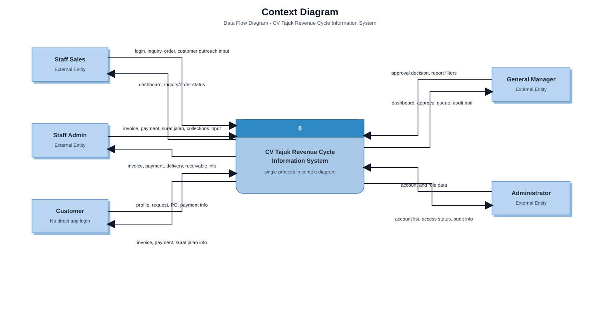
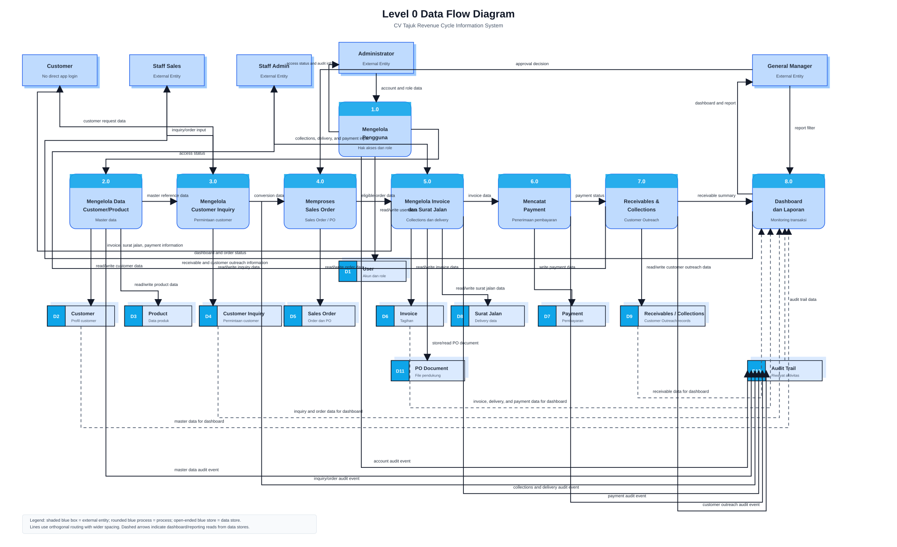

# Data Flow Diagram

Last verified against repository: 20 July 2026

## 1. Tujuan

Data Flow Diagram (DFD) digunakan dalam system analysis untuk menggambarkan bagaimana data masuk ke sistem, diproses oleh sistem, disimpan, dan dikembalikan sebagai informasi kepada pengguna atau pihak eksternal. DFD membantu memisahkan fokus analisis dari detail tampilan, urutan klik, struktur database fisik, atau desain komponen teknis.

Dalam konteks CV Tajuk Revenue Cycle Information System, DFD menjelaskan aliran data pada proses revenue cycle yang ditemukan dalam repository: login dan role, customer, product, customer inquiry, sales order/customer PO, invoice, payment, surat jalan, receivable, customer outreach/collections, dashboard, laporan, dan audit trail.

## 2. Ruang Lingkup

DFD ini mencakup proses revenue cycle CV Tajuk sesuai source code dan dokumentasi project. Aliran yang dicakup meliputi pengelolaan pengguna, master customer/product, customer inquiry, sales order/customer PO, invoice, payment, surat jalan, receivable, customer outreach, dashboard, laporan/export, dan audit trail.

DFD ini tidak mencakup sistem stok existing CV Tajuk, inventory management, stock movement, warehouse management, ERP, accounting journal, bank integration, payment gateway, courier tracking, atau automated external API integration. README menyatakan area tersebut berada di luar scope MVP. Customer ditampilkan sebagai external business entity karena data customer, permintaan barang, PO, dan informasi pembayaran berasal dari customer, tetapi repository tidak menunjukkan customer login atau customer portal.

## 3. Elemen DFD

| Elemen | Pengertian dalam DFD ini |
| --- | --- |
| External Entity | Pihak di luar sistem yang memberikan data ke sistem atau menerima informasi dari sistem, misalnya Staff Sales, Staff Admin, General Manager, Admin / Manager, dan Customer. |
| Process | Aktivitas sistem yang mengubah input data menjadi output informasi, misalnya memproses Sales Order atau mencatat Payment. |
| Data Flow | Aliran data yang diberi nama pada panah, misalnya `payment record input`, `invoice data`, atau `dashboard and report`. |
| Data Store | Tempat data disimpan atau dibaca kembali oleh proses. Data store terutama diturunkan dari Prisma schema; Receivable dicatat sebagai data store logis karena di source code piutang dihitung dari data Invoice, bukan tabel fisik terpisah. |

Notasi diagram yang digunakan mengikuti bentuk DFD sederhana: external entity digambarkan sebagai kotak biru dengan bayangan, process sebagai rounded rectangle biru dengan nomor proses di bagian header, data store sebagai kotak penyimpanan terbuka dengan kode D1, D2, dan seterusnya, sedangkan data flow digambarkan sebagai panah berlabel.

## 4. External Entities

| External entity | Data yang diberikan ke sistem | Informasi yang diterima dari sistem |
| --- | --- | --- |
| Staff Sales | Login data, input customer/product terkait sales, customer inquiry, sales order/customer PO, customer outreach. | Dashboard sales, customer status, inquiry status, order/customer PO status, customer outreach reminders, laporan atau export yang dapat diakses. |
| Staff Admin | Login data, input invoice, payment, surat jalan, collection/customer outreach collection, review master/transaction data. | Invoice list, payment status, surat jalan document, receivable list, collection information, dashboard admin, audit trail review. |
| General Manager | Login data, approval decision, monitoring request, report/dashboard filters. | Management dashboard, approval queue, revenue-cycle report, audit trail, status order/invoice/payment/receivable. |
| Admin / Manager | Login data, user account data, role/status account data, audit/report review request. | Account list, access/session status, audit trail information, account management result. |
| Customer | Customer profile/contact data, product request, PO document for Customer PO, payment information, delivery recipient information. | Invoice information, payment status/receipt information, surat jalan information, customer outreach or collection information. Tidak ada akses langsung ke aplikasi dalam source code. |

## 5. Data Stores

| ID data store | Nama data store | Data utama yang disimpan |
| --- | --- | --- |
| D1 | User | Username, password hash, display name, role, status, created/updated timestamp. |
| D2 | Customer | Contact Person, Company Name, phone, email, address, Customer Segment, status, notes, relasi ke inquiry/order/invoice/customer outreach/surat jalan. |
| D3 | Product | Product name, price, status, notes, relasi ke order item dan inquiry item. |
| D4 | Customer Inquiry | Inquiry number, customer, needed date, status, status note, inquiry items, requested/agreed price, linked sales order. |
| D5 | Sales Order | Sales Order Number, Customer PO Number, order source, customer PO document metadata, customer, order date, status, subtotal/total, payment terms, approval status/risk, sales order items. |
| D6 | Invoice | Invoice number, linked sales order, customer, issue date, due date, total amount, paid amount, remaining amount, payment terms, status, notes. Data receivable dihitung terutama dari field invoice ini. |
| D7 | Payment | Invoice, payment date, amount, payment method, notes, created/updated timestamp. |
| D8 | Surat Jalan | Delivery note number, invoice/sales order/customer reference, recipient data, delivery date, status, signature-related fields, delivery note items. |
| D9 | Receivable, Collection Tasks, and Customer Outreach | Data store logis untuk receivable yang berasal dari Invoice, serta data fisik CollectionTask untuk penagihan pembayaran dan CustomerOutreach untuk kontak pelanggan mengenai produk. |
| D10 | Audit Trail | Actor, role, module, entity type, entity id, record reference, action, change summary, action note, old value, new value, created timestamp. |
| D11 | PO Document Storage | Dokumen PO Customer PO di Supabase Storage. Metadata file disimpan pada SalesOrder, sedangkan file berada di storage bucket. |

## 6. Context Diagram

Context Diagram menampilkan seluruh aplikasi sebagai satu proses bernama **CV Tajuk Revenue Cycle Information System**. External entity mengirim data ke sistem dan menerima informasi kembali dari sistem. Diagram ini tidak menampilkan data store internal karena tujuannya adalah memperlihatkan batas sistem secara keseluruhan.

Aliran data utama pada Context Diagram:

| External entity | Data masuk ke sistem | Data keluar dari sistem |
| --- | --- | --- |
| Staff Sales | Login data, inquiry/order/customer outreach input. | Dashboard sales, inquiry/order status, customer outreach reminder. |
| Staff Admin | Invoice, payment, surat jalan, collection input. | Invoice, payment, delivery, receivable, dan collection information. |
| General Manager | Approval decision dan report filters. | Dashboard, approval queue, audit trail, dan revenue-cycle report. |
| Admin / Manager | Account and role data. | Account list, access status, dan audit information. |
| Customer | Profile, request, PO, payment, dan delivery recipient information. | Invoice, payment status, surat jalan, dan customer outreach information. |

## 7. Level 0 Data Flow Diagram

Level 0 DFD memecah proses utama menjadi 8 proses agar tetap sederhana dan sesuai skala UMKM. Proses dibuat berdasarkan pages, forms, server actions, Prisma schema, business logic, dashboard, dan audit trail yang ditemukan di repository.

| Process | Input | Output | External entity | Data store terkait |
| --- | --- | --- | --- | --- |
| 1.0 Mengelola Pengguna dan Hak Akses | Login data, account and role input. | Session/access status, account status, account audit event. | Staff Sales, Staff Admin, General Manager, Admin / Manager. | D1 User, D10 Audit Trail. |
| 2.0 Mengelola Data Customer dan Product | Customer input, product input, customer profile/contact data, master data update/review input. | Customer/product list, customer/product status, master data audit event. | Staff Sales, Staff Admin, General Manager, Customer. | D2 Customer, D3 Product, D10 Audit Trail. |
| 3.0 Mengelola Customer Inquiry | Inquiry details, item request, needed date, customer/product reference data. | Inquiry record, inquiry status, conversion option, inquiry audit event. | Staff Sales, General Manager, Customer. | D2 Customer, D3 Product, D4 Customer Inquiry, D10 Audit Trail. |
| 4.0 Memproses Sales Order / Customer PO | Sales order/customer PO input, eligible inquiry data, customer/payment risk data, product price data, PO document, approval decision. | Sales order/customer PO data, PO metadata/file, order status, approval result, conditional invoice/credit collection task trigger, order audit event. | Staff Sales, General Manager, Customer. | D2 Customer, D3 Product, D4 Customer Inquiry, D5 Sales Order, D6 Invoice, D9 Receivable and Collection Tasks, D11 PO Document Storage, D10 Audit Trail. |
| 5.0 Mengelola Invoice dan Surat Jalan | Eligible sales order data, invoice input, payment terms/status for delivery validation, delivery recipient data, surat jalan input. | Invoice data, planned credit collection task, surat jalan data, invoice/delivery information, invoice/delivery audit event. | Staff Admin, General Manager, Customer. | D2 Customer, D5 Sales Order, D6 Invoice, D8 Surat Jalan, D9 Receivable and Collection Tasks, D10 Audit Trail. |
| 6.0 Mencatat Payment | Payment record input, payment information from customer, open invoice data. | Payment data, updated invoice amount/status, payment status information, payment audit event. | Staff Admin, General Manager, Customer. | D6 Invoice, D7 Payment, D10 Audit Trail. |
| 7.0 Mengelola Receivable, Collections, dan Customer Outreach | Invoice remaining amount, due date, payment history, collection task input, customer outreach input. | Receivable status, overdue invoice status update, Collection Task record, Customer Outreach record, collection list, outreach reminder, and their audit events. | Staff Admin, Staff Sales, General Manager. | D2 Customer, D6 Invoice, D7 Payment, D9 Receivable and Collection Tasks, D10 Audit Trail. |
| 8.0 Menghasilkan Dashboard dan Laporan | Dashboard/report request, customer/order/invoice/payment/delivery/customer outreach/audit data. | Dashboard, management report, operational report, export, audit view. | Staff Sales, Staff Admin, General Manager, Admin / Manager. | D2 Customer, D5 Sales Order, D6 Invoice, D7 Payment, D8 Surat Jalan, D9 Receivable and Collection Tasks, D10 Audit Trail. |

Catatan implementasi:

- Receivable tidak memiliki tabel fisik pada Prisma schema. Halaman Receivables membaca Invoice dan menentukan receivable aktif dari `remainingAmount`, `status`, dan `dueDate`, lalu memperbarui status Invoice menjadi `Overdue` jika sudah melewati jatuh tempo.
- Customer PO bukan tabel terpisah. Customer PO adalah SalesOrder dengan `source = CUSTOMER_PO`, Customer PO Number, required date, dan metadata dokumen customer PO.
- Dokumen Customer PO menggunakan Supabase Storage melalui `src/lib/customer-po-storage.ts`; metadata dokumen tetap berada pada SalesOrder.
- Audit Trail ditulis oleh server actions penting melalui `createAuditTrailLog`, bukan oleh user secara manual.
- Dashboard membaca data operasional dari beberapa data store dan tidak menyimpan agregasi dashboard sebagai tabel tersendiri.
- Persetujuan Manager atas order berisiko dapat membuat Invoice otomatis; untuk order kredit, aplikasi juga membuat Collection Task terencana. DFD menampilkan keduanya sebagai output bersyarat.
- Label Admin / Manager menunjukkan pelaksana pengelolaan akun; aplikasi tidak memiliki role terpisah bernama Administrator.

## 8. Validasi DFD

| Aturan validasi | Hasil pemeriksaan |
| --- | --- |
| Context Diagram dan Level 0 memiliki input-output yang konsisten. | Konsisten. External entity pada Context Diagram juga muncul pada Level 0 dengan data flow yang lebih rinci. |
| External entity tidak langsung mengakses data store. | Terpenuhi. External entity hanya terhubung ke process. |
| Data store tidak langsung mengirim data ke data store lain. | Terpenuhi. Data store hanya terhubung ke process, tidak ke data store lain. |
| Setiap process memiliki input dan output. | Terpenuhi melalui tabel proses Level 0 dan diagram. |
| Semua panah memiliki nama data flow. | Terpenuhi pada file Mermaid dan SVG. |
| Diagram tidak menggunakan start, end, atau decision. | Terpenuhi. Diagram menggunakan external entity, process, data store, dan named data flow. |
| Diagram tidak menampilkan detail tombol/urutan klik. | Terpenuhi. Detail UI seperti tombol, modal, dan urutan klik tidak digambarkan sebagai proses DFD. |

## 9. Kesimpulan

Aliran data utama aplikasi dimulai dari login dan validasi hak akses, lalu berlanjut ke pengelolaan master customer/product, customer inquiry, sales order/customer PO, invoice, payment, surat jalan, receivable, customer outreach, dashboard, dan audit trail. Data yang sama digunakan ulang di beberapa proses sehingga aplikasi mengurangi input manual berulang, misalnya data Sales Order digunakan untuk Invoice, Surat Jalan, Receivable, dan Dashboard.

DFD ini menunjukkan bahwa sistem sesuai untuk skala UMKM karena proses utama masih sederhana dan berada dalam satu aplikasi web. Sistem stok existing, payment gateway, bank integration, ERP, warehouse, dan courier tidak menjadi bagian dari DFD karena tidak ditemukan sebagai integrasi source code maupun requirement aktif.

## Inkonsistensi Dokumentasi dan Source Code

Beberapa hal yang perlu diperhatikan ketika DFD digunakan untuk thesis:

1. Dokumentasi fitur lama menyebut beberapa modul memiliki edit/delete penuh untuk Invoice, Payment, dan Surat Jalan. Source code terbaru yang diperiksa lebih terbatas: Invoice memiliki update notes dan print view; Payment terutama memiliki record payment; Surat Jalan memiliki create dan update status.
2. Role matrix dokumentasi menyebut Admin tidak membuat Customer Inquiry, tetapi action `createCustomerInquiry` di source code hanya memanggil `requireCurrentUser` dan belum memiliki `canRole` khusus Customer Inquiry.
3. Testing Matrix memiliki skenario “Admin” membuat Sales Order pada beberapa baris, sedangkan `canRole` pada source code membatasi `CREATE_SALES_ORDER` untuk Sales dan Manager; Admin tidak boleh membuat Sales Order.
4. Activity diagram menampilkan Customer sebagai swimlane yang menerima produk/dokumen, tetapi source code tidak menyediakan customer portal atau customer login. Karena itu DFD menempatkan Customer sebagai external business entity, bukan pengguna aplikasi langsung.
