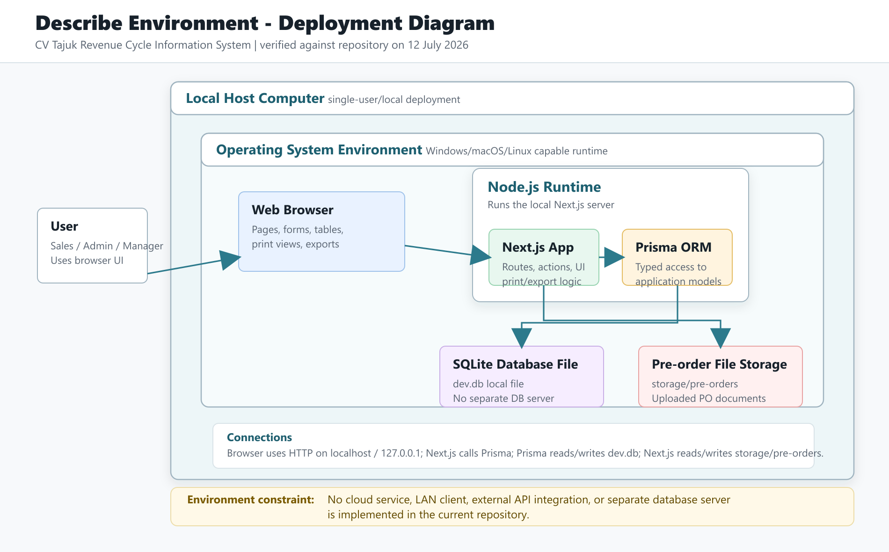
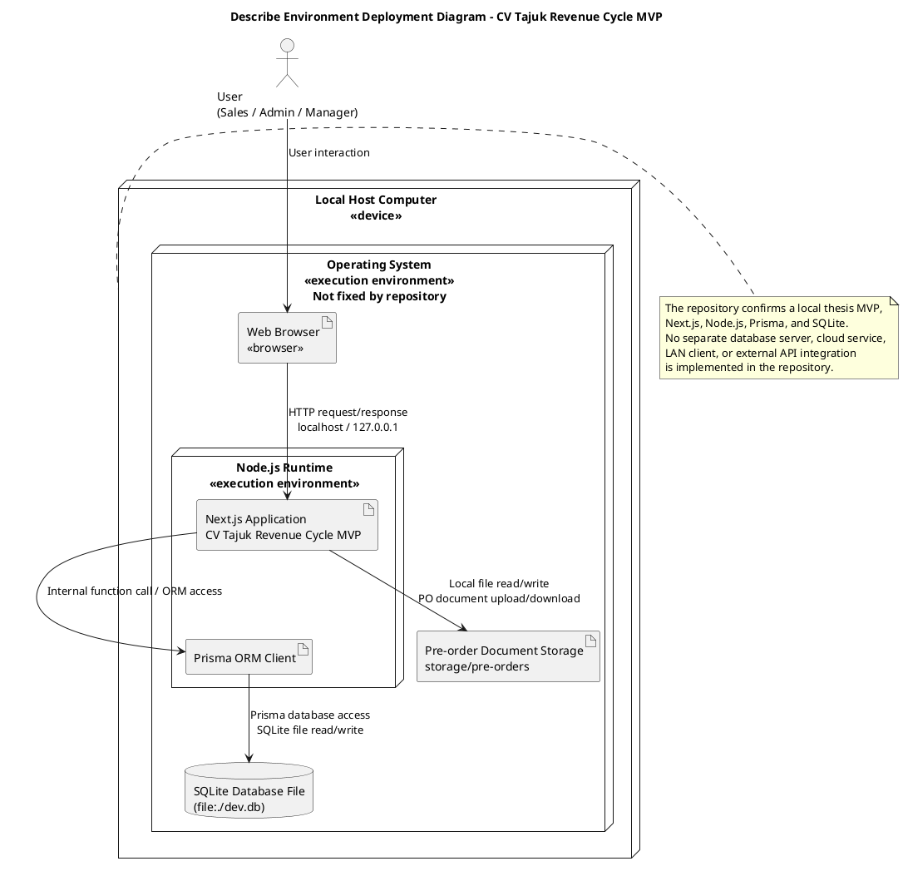

# Describe Environment

Last verified against repository: 12 July 2026

## 1. Tujuan Describe Environment

Dalam pendekatan Satzinger, Jackson, dan Burd, aktivitas *Describe Environment* digunakan untuk mendokumentasikan lingkungan tempat sistem informasi akan dijalankan. Fokusnya bukan membuat rancangan komponen aplikasi secara detail, melainkan menjelaskan bagaimana sistem berinteraksi dengan lingkungan eksternal dan bagaimana sistem ditempatkan di dalam arsitektur teknologi organisasi.

Dua elemen utama yang dijelaskan adalah:

1. **External systems**, yaitu sistem, perangkat lunak, perangkat, sumber data, atau pihak luar yang berinteraksi dengan sistem.
2. **Technology architecture**, yaitu susunan perangkat keras, perangkat lunak, jaringan, runtime, database, browser, dan mekanisme komunikasi yang memungkinkan sistem berjalan.

Aktivitas ini mengevaluasi apakah sistem yang diusulkan sesuai dengan lingkungan teknologi yang ada atau yang direncanakan. Oleh karena itu, dokumen ini membedakan antara lingkungan yang sudah terimplementasi di repository, lingkungan yang masih berupa rencana, asumsi yang perlu dikonfirmasi, dan batasan yang berada di luar cakupan MVP.

## 2. Sumber Bukti Repository

| Evidence | File or Folder | Finding | Confidence |
| --- | --- | --- | --- |
| Deskripsi proyek lokal dan scope MVP | `README.md` | Repository menyatakan sistem adalah local thesis MVP untuk revenue cycle CV Tajuk, dijalankan dengan `npm run dev`, dan dibuka melalui local URL, biasanya `http://127.0.0.1:3000`. | High |
| Stack dan scripts | `package.json` | Stack terverifikasi: Next.js, React, TypeScript, Prisma Client, SQLite via Prisma, Tailwind CSS, Vitest, ESLint, ExcelJS. Scripts tersedia untuk dev, build, start, lint, test, Prisma generate/migrate/deploy/seed. | High |
| Database provider dan model data | `prisma/schema.prisma` | Datasource menggunakan SQLite dengan `DATABASE_URL`; terdapat model `User`, `Customer`, `Product`, `SalesOrder`, `Invoice`, `Payment`, `FollowUp`, `DeliveryNote`, `AuditTrail`, dan related items. | High |
| Environment configuration | `.env.example`, `prisma.config.ts` | Environment yang terlihat hanya `DATABASE_URL="file:./dev.db"`; Prisma config membaca `DATABASE_URL` dari environment. Tidak ada secret eksternal atau API key pada contoh environment. | High |
| Konfigurasi aplikasi | `next.config.mjs` | Next.js memakai `distDir: ".next-local"` dan server actions body size limit 10 MB. Tidak ditemukan konfigurasi cloud deployment. | High |
| Prisma client runtime | `src/lib/prisma.ts` | Aplikasi membuat `PrismaClient` lokal dengan log error dan cache global saat bukan production. | High |
| Autentikasi | `src/lib/auth.ts`, `src/lib/auth-actions.ts`, `src/lib/session.ts` | Login memverifikasi user dari database, password disimpan sebagai salted SHA-256 hash, session disimpan pada cookie `cv_tajuk_session` dengan `httpOnly`, `sameSite: "lax"`, dan umur 8 jam. | High |
| Proteksi route | `src/proxy.ts` | Proxy Next.js mengalihkan user tanpa session ke `/login` dan user yang sudah login dari `/login` ke `/`. | High |
| Otorisasi role | `src/lib/role-access.ts`, `src/app/settings/page.tsx` | Role `MANAGER`, `ADMIN`, dan `SALES` digunakan untuk membatasi pembuatan Sales Order, Invoice, Payment, Surat Jalan, Account, dan penghapusan Sales Order. | High |
| Audit trail | `src/lib/audit.ts`, `prisma/schema.prisma` | Aksi penting ditulis ke tabel `AuditTrail` dengan actor, role, module, action, old value, new value, dan action note. | High |
| Penyimpanan dokumen PO | `src/lib/actions.ts`, `src/app/api/pre-orders/[salesOrderId]/document/route.ts`, `storage/pre-orders` | Dokumen Pre Order disimpan sebagai file lokal di `storage/pre-orders`; route download membaca file lokal setelah memvalidasi nama file dengan `basename`. | High |
| Export Excel | `src/app/api/sales-orders/export/route.ts`, `src/components/sales-order-export-dialog.tsx` | Export Sales Order/Pre Order menghasilkan workbook `.xlsx` menggunakan ExcelJS dan dikirim melalui response HTTP. | High |
| Print output | `src/components/print-button.tsx`, `src/app/invoices/[invoiceId]/print/page.tsx`, `src/app/surat-jalan/[deliveryNoteId]/print/page.tsx` | Invoice dan Surat Jalan memiliki route print terimplementasi dan dicetak melalui `window.print()` di browser; tidak ada integrasi printer khusus. Route print Sales Order tidak teridentifikasi pada source saat verifikasi ini. | High |
| Responsive interface evidence | `src/components/app-shell.tsx`, `src/styles/globals.css`, page components | Desktop sidebar memakai `lg:flex`; mobile header memakai `lg:hidden`; tabel memakai `overflow-x-auto`; CSS memiliki media query mobile dan print. | High |
| Test tools | `tests/`, `package.json`, `eslint.config.mjs`, `tsconfig.json` | Vitest digunakan untuk unit/integration tests; ESLint dan TypeScript strict configuration tersedia. | High |
| Dokumentasi fitur | `CURRENT_APP_FEATURES.txt`, `docs/USER_FLOWS.md`, `docs/TESTING_MATRIX.md` | Dokumen mendukung fitur role, notifikasi, table tools, print, Excel export, dan testing evidence. Ada perbedaan dengan sebagian README lama terkait role control, dan ada klaim dokumen fitur tentang printable Sales Order yang belum terlihat sebagai route print pada source. | Medium |

## 3. Ringkasan Lingkungan Sistem

Sistem CV Tajuk Revenue Cycle Information System beroperasi sebagai aplikasi web lokal untuk demonstrasi tesis. Bukti utama berasal dari `README.md` yang menyebut aplikasi sebagai *local thesis MVP*, instruksi `npm run dev`, dan local URL yang biasanya berupa `http://127.0.0.1:3000`. Aplikasi tidak menunjukkan konfigurasi cloud server, payment gateway, bank API, ERP, email service, atau layanan eksternal lain.

Lingkungan terimplementasi terdiri dari browser sebagai antarmuka pengguna, Next.js sebagai aplikasi web/server, Node.js sebagai runtime, Prisma ORM sebagai mekanisme akses data, dan SQLite sebagai database berbasis file. Database dikonfigurasi melalui `DATABASE_URL="file:./dev.db"`, sehingga lokasi database berada pada file lokal relatif terhadap konfigurasi Prisma. Dokumen Pre Order disimpan sebagai file lokal pada folder `storage/pre-orders`.

Pengguna yang terimplementasi adalah role `SALES`, `ADMIN`, dan `MANAGER`. User mengakses antarmuka melalui browser. Repository menunjukkan dukungan layout desktop dan mobile secara teknis, tetapi target operasional yang terkonfirmasi adalah penggunaan lokal melalui browser pada komputer/laptop. Kebutuhan internet tidak teridentifikasi untuk runtime aplikasi setelah dependency tersedia, karena aplikasi tidak memanggil API eksternal. Internet hanya mungkin diperlukan untuk instalasi dependency awal atau aktivitas di luar aplikasi, yang berada di luar scope runtime repository.

Tidak ditemukan integrasi otomatis dengan external systems. Informasi dari pelanggan, dokumen PO, bukti pembayaran, atau dokumen cetak dapat menjadi sumber informasi bisnis eksternal, tetapi repository menunjukkan bahwa data tersebut dimasukkan atau diunggah secara manual, bukan melalui koneksi sistem-ke-sistem.

## 4. Technology Architecture

| Architecture Element | Actual Technology | Function | Repository Evidence | Constraint |
| --- | --- | --- | --- | --- |
| Host hardware | Not identified from the repository | Menjalankan aplikasi, runtime, database file, dan local storage. | Tidak ada spesifikasi hardware di repo. | Assumption: komputer lokal/laptop harus tersedia dan cukup kuat menjalankan Node.js serta SQLite. |
| Host operating system | Not fixed by repository; Windows-compatible workflow documented | Menyediakan filesystem dan shell untuk menjalankan Node.js/Next.js. | `README.md` menyebut Windows PowerShell dan `npm.cmd`; workspace berada pada path Windows. | Tidak ada persyaratan OS formal; Windows adalah asumsi kuat untuk lingkungan pengguna saat ini. |
| User device | Desktop/laptop browser client; mobile technically possible | Perangkat untuk mengakses UI. | `README.md` local URL; `app-shell.tsx` desktop sidebar dan mobile header. | Tidak ada bukti deployment multi-device melalui LAN. |
| Browser | Web browser, specific browser not identified | Menampilkan UI, menjalankan client-side React, membuka print dialog, menyimpan read notification ids di `localStorage`. | `PrintButton` memakai `window.print()`; `NotificationButton` memakai `localStorage`. | Browser minimum/version tidak diidentifikasi. |
| User-interface technology | React, Tailwind CSS, lucide-react icons | Membentuk tampilan halaman, responsive layout, navigasi, tabel, form, dialog. | `package.json`, `app-shell.tsx`, `globals.css`. | Mobile support teknis ada, tetapi device testing tidak teridentifikasi. |
| Programming language | TypeScript | Implementasi aplikasi, server actions, tests, Prisma seed. | `package.json`, `tsconfig.json`, `src/**/*.ts`, `src/**/*.tsx`. | Tidak ada mixed backend language lain. |
| Application framework | Next.js 16.2.1 | Web framework untuk routing, server components, server actions, API routes, build/start/dev. | `package.json`, `next.config.mjs`, `src/app`. | Tidak ada konfigurasi production hosting. |
| Runtime environment | Node.js | Menjalankan Next.js, Prisma, file I/O, Excel export. | `package.json`, route `runtime = "nodejs"`, Node modules used in code. | Versi Node minimum tidak eksplisit di repository. |
| Web/application server | Next.js development/production server through npm scripts | Melayani halaman dan API routes. | Scripts `next dev`, `next build`, `next start` pada `package.json`. | Deployment server eksternal tidak teridentifikasi. |
| ORM/data access | Prisma ORM / Prisma Client | Menghubungkan aplikasi ke SQLite dan menjalankan query model. | `prisma/schema.prisma`, `src/lib/prisma.ts`. | Tergantung validitas `DATABASE_URL`. |
| Database technology | SQLite | Penyimpanan data operasional revenue cycle. | `datasource db { provider = "sqlite" }` pada `prisma/schema.prisma`. | Cocok untuk MVP lokal; bukan arsitektur database server terpusat. |
| Database location | Local SQLite file, default `file:./dev.db` | Menyimpan data aplikasi pada file lokal. | `.env.example`, `prisma.config.ts`. | Backup dan multi-user centralized access tidak terimplementasi. |
| Network model | Localhost/local web access | Browser mengakses aplikasi melalui local URL. | `README.md` menyebut local URL dan `http://127.0.0.1:3000`. | Tidak ada bukti LAN, DNS, reverse proxy, atau public internet deployment. |
| Communication protocol | HTTP over localhost/local URL | Request/response antara browser dan Next.js app. | README local URL; Next.js scripts. | HTTPS tidak teridentifikasi. |
| Development tools | npm scripts, Prisma CLI, TypeScript, ESLint | Development, migration, linting, build, seeding. | `package.json`, `eslint.config.mjs`, `tsconfig.json`, `prisma.config.ts`. | Tidak ada CI/CD pipeline teridentifikasi. |
| Test tools | Vitest, Testing Library, ESLint | Unit/integration test dan quality checks. | `package.json`, `tests/`. | Tidak semua environmental controls diuji. |
| Authentication | Local username/password with cookie session | Membatasi akses aplikasi. | `auth.ts`, `auth-actions.ts`, `session.ts`, `proxy.ts`. | README menyebut bukan production security; cookie tidak menunjukkan `secure` flag. |
| Authorization | Role-based capability checks | Membatasi action tertentu untuk `SALES`, `ADMIN`, `MANAGER`. | `role-access.ts`, `RestrictedAction`, action handlers. | Dokumentasi README lama menyatakan role tidak mengontrol akses; implementasi terbaru sudah mengontrol beberapa action. |
| Logging/audit | Database audit trail plus Prisma error logging | Mencatat aksi bisnis dan error Prisma. | `AuditTrail` model, `audit.ts`, `prisma.ts`. | Tidak ada centralized log server. |
| Backup mechanism | Not identified from the repository | Pemulihan data. | Tidak ada script backup khusus. | Assumption: backup manual file SQLite dan `storage/pre-orders`. |
| Deployment model | Local deployment through npm scripts | Menjalankan sistem pada satu host lokal. | `README.md`, `package.json`. | Tidak ada Docker, cloud, server LAN, atau production deployment code. |

## 5. External Systems and Databases

Berdasarkan repository, aplikasi saat ini beroperasi sebagai stand-alone system. Tidak ditemukan integrasi otomatis ke payment gateway, bank, ERP, email service, WhatsApp API, courier API, cloud storage, atau database eksternal. Browser adalah client UI, bukan sistem bisnis eksternal. Dokumen PO dan informasi pelanggan dapat berasal dari luar organisasi, tetapi dimasukkan secara manual.

| External System | Owner | Interaction Purpose | Input Data | Output Data | Timing/Frequency | Protocol | Security | Evidence |
| --- | --- | --- | --- | --- | --- | --- | --- | --- |
| Web Browser | User / local computer user | Client UI untuk mengakses sistem | Form input, clicks, uploaded PO document, date filters | HTML UI, file download, print dialog | Setiap sesi penggunaan | HTTP over localhost/local URL | Session cookie `httpOnly`, sameSite lax; no HTTPS identified | `README.md`, `PrintButton`, `NotificationButton`, `proxy.ts` |
| Browser print facility / local printer | User environment | Mencetak atau menyimpan PDF Invoice dan Surat Jalan | Printable invoice/delivery note page | Printed paper/PDF via browser | Saat user memilih print | Browser print API (`window.print`) | Tergantung browser dan OS; tidak dikontrol aplikasi | `print-button.tsx`, invoice and Surat Jalan print pages |
| Manually sourced PO/customer/payment information | Customer / business process outside app | Sumber data bisnis yang dimasukkan ke sistem | PO document, customer data, payment notes, invoice references | Data tercatat di database lokal | Saat user menginput/mengunggah data | Manual entry/file upload; not automated integration | Validasi aplikasi terbatas; file PO disimpan lokal | `sales-order-form.tsx`, `actions.ts`, `pre-orders document route` |
| Excel workbook output | User environment | Export Sales Order/Pre Order untuk laporan | Date range and transaction type | `.xlsx` workbook | Saat user menjalankan export | HTTP download from local app | Requires authenticated active user | `sales-orders/export/route.ts`, `sales-order-export-dialog.tsx` |
| External automated API/service | Not identified | Not identified | Not identified | Not identified | Not identified | Not identified | Not identified | README explicitly excludes external API dependencies; code search found no implemented external API integration |

## 6. User and User-Interface Environment

| User Role | Work Location | Device | Operating System | Interface | Browser/Software | Access Method |
| --- | --- | --- | --- | --- | --- | --- |
| SALES | Assumption: CV Tajuk operational/admin location; exact location not identified | Desktop/laptop; mobile technically possible | Not fixed; Windows-compatible workflow documented | Web UI, role-specific dashboard, customer/sales order/follow-up modules | Web browser; specific browser not identified | Local URL/localhost on the host computer; LAN access is outside current repository evidence |
| ADMIN | Assumption: CV Tajuk operational/admin location; exact location not identified | Desktop/laptop; mobile technically possible | Not fixed; Windows-compatible workflow documented | Web UI, invoice, payment, Surat Jalan, billing, settings modules | Web browser; specific browser not identified | Local URL/localhost on the host computer; LAN access is outside current repository evidence |
| MANAGER | Assumption: CV Tajuk management/admin location; exact location not identified | Desktop/laptop; mobile technically possible | Not fixed; Windows-compatible workflow documented | Web UI, dashboard, approval, all major modules | Web browser; specific browser not identified | Local URL/localhost on the host computer; LAN access is outside current repository evidence |

Repository menunjukkan responsivitas teknis melalui desktop sidebar, mobile header, grid responsive, `overflow-x-auto` untuk tabel, dan media query print/mobile. Namun, tidak ditemukan bukti pengujian perangkat mobile nyata. Oleh karena itu, mobile use dideskripsikan sebagai *technically possible*, bukan kebutuhan operasional yang terkonfirmasi.

Simultaneous multi-user access tidak dikonfirmasi oleh repository. Next.js secara teknis dapat melayani beberapa request, tetapi model local SQLite file dan tidak adanya konfigurasi server jaringan menunjukkan bahwa penggunaan utama adalah pada satu host lokal. Akses dari perangkat lain melalui LAN berada di luar bukti repository dan memerlukan konfigurasi tambahan.

## 7. Automated Input and Output Devices

| Item | Status | Explanation | Evidence |
| --- | --- | --- | --- |
| Barcode scanner | Not present | Tidak ada module atau dependency untuk barcode scanning. | Tidak ditemukan di `package.json` atau source. |
| Dedicated printer integration | Not present | Tidak ada driver printer, print server, atau API printer. | Print memakai `window.print()`. |
| Browser printing | Indirectly supported through browser | Invoice dan Surat Jalan dapat dicetak atau disimpan PDF melalui print dialog browser. Print route untuk Sales Order tidak teridentifikasi pada source saat verifikasi ini. | `print-button.tsx`, invoice and Surat Jalan print pages, `@media print`. |
| Camera | Not present | Tidak ada penggunaan kamera/browser media API. | Tidak ditemukan di source. |
| File import | Partially implemented | PO document upload untuk Pre Order; tidak ada bulk Excel/CSV import data master. | `getPreOrderDocument`, `storePreOrderDocument`, `storage/pre-orders`. |
| File export | Implemented | Sales Order/Pre Order dapat diekspor sebagai `.xlsx`. | ExcelJS route. |
| Document generation | Implemented as web printable pages | Invoice dan Surat Jalan dibuat sebagai HTML printable page. Sales Order/Pre Order memiliki detail dan Excel export, tetapi route printable khusus tidak teridentifikasi pada source. | Print pages; export route. |
| Email service | Not present | Tidak ada SMTP/provider email. | No dependency/config/code evidence. |
| PDF generator | Not present as application dependency | PDF dapat dibuat oleh browser print dialog, bukan generator PDF terintegrasi. | `window.print()`; no PDF package in `package.json`. |

## 8. Communication and Data Flow

Browser berkomunikasi dengan aplikasi Next.js melalui HTTP pada local URL. Aplikasi menjalankan server-side rendering, server actions, dan API routes. Akses database dilakukan melalui Prisma Client ke SQLite file lokal. Untuk dokumen PO, aplikasi membaca dan menulis file pada folder lokal `storage/pre-orders`. Export Excel dikirim sebagai response file `.xlsx`. Komunikasi tidak harus meninggalkan host komputer apabila aplikasi dibuka melalui localhost.

| Source | Destination | Data | Trigger/Frequency | Protocol or Interface | Security |
| --- | --- | --- | --- | --- | --- |
| User | Web Browser | Input form, navigation, print/download actions | Setiap interaksi user | UI interaction | Tergantung kontrol browser/OS |
| Web Browser | Next.js Application | HTTP requests, form submissions, API requests, cookies | Page load, submit, export, document download | HTTP over localhost/local URL | Session cookie `httpOnly`; HTTPS not identified |
| Next.js Application | Web Browser | HTML, React UI, redirects, file responses | Setiap request | HTTP response | Access controlled by proxy/session for protected pages |
| Next.js Server Actions/API Routes | Prisma Client | Query and mutation request | Create/update/read/delete business process | Internal function call / Prisma API | Server-side only; Prisma client not exposed to browser |
| Prisma Client | SQLite Database File | Business records, users, audit trail | Each database operation | Prisma database access to SQLite | Local file protection depends on OS/filesystem |
| Next.js Application | Local File Storage | Uploaded/downloaded Pre Order documents | Pre Order create and document open | Node.js filesystem read/write | Authenticated route; filename sanitized with `basename`; file permissions depend on OS |
| Next.js API Route | Browser | Excel workbook binary | User requests export with valid date range | HTTP file download | Requires active authenticated user |
| Browser | Local printer/PDF function | Printable document rendering | User clicks print | Browser print API | Outside application control |

## 9. Security Environment

| Security Area | Implemented Control | Evidence | Limitation or Risk |
| --- | --- | --- | --- |
| Authentication | Username/password checked against `User` table; inactive users rejected. | `login()` in `auth-actions.ts`; `UserStatus` enum. | README states this is simple local demo access, not production security. |
| Password storage | Salted SHA-256 hash with timing-safe comparison. | `hashPassword()` and `verifyPassword()` in `auth.ts`. | SHA-256 is not an adaptive password hashing algorithm such as bcrypt/Argon2. |
| Session/cookie | Cookie `cv_tajuk_session`, `httpOnly`, `sameSite: "lax"`, `maxAge` 8 hours. | `auth-actions.ts`. | `secure` flag not shown; suitable mainly for local HTTP demo. |
| Route protection | Proxy redirects unauthenticated users to `/login`. | `src/proxy.ts`. | Cookie stores user id; no signed/encrypted session token identified. |
| Authorization | Capability checks for role-based actions; shared module viewing remains broadly available across roles. | `role-access.ts`, actions and restricted UI components. | Scope is action-level, not a complete page-by-page access isolation model. |
| Input validation | Required fields, enum/status allowlists, amount/date checks, file type/size checks. | `actions.ts`, export route, auth actions. | Validation is implemented per action; no centralized validation framework identified. |
| File upload/download | PO files limited by type/size; stored name randomized; download uses `basename` and authenticated route. | `getPreOrderDocument`, `storePreOrderDocument`, document route. | Local file permissions and malware scanning are outside current scope. |
| Database access | Database operations occur server-side through Prisma. | `src/lib/prisma.ts`, server actions. | SQLite file protection depends on host filesystem; no database user accounts. |
| Audit trail | Business actions written to `AuditTrail` table with actor and old/new values. | `audit.ts`, schema `AuditTrail`. | Audit creation catches and logs errors; no external immutable log storage. |
| Network exposure | Local URL documented; no public deployment config. | `README.md`. | If exposed to LAN/internet manually, security posture would need review. |
| Environmental secrets | `.env.example` only shows local `DATABASE_URL`. | `.env.example`. | Production secret management not identified. |
| Backup/recovery | Not implemented in repository. | No backup script found. | Manual backup required for SQLite file and storage folder. |

## 10. Environmental Constraints and Assumptions

### Constraints

| Constraint | Impact on the System |
| --- | --- |
| Localhost/local thesis deployment is the confirmed deployment model. | System is suitable for demonstration and local operation, not confirmed for production web hosting. |
| SQLite database is stored as a local file. | Simple setup, but limited centralized access and operational backup capability. |
| No cloud server or external API integration is implemented. | Revenue-cycle data remains stand-alone and manually entered; no automated bank, ERP, courier, or email exchange. |
| No dedicated backup mechanism in repository. | Data recovery depends on manual backup of SQLite file and uploaded documents. |
| Browser print is the only print mechanism. | Printing depends on browser/OS dialog and installed printer/PDF capability. |
| Authentication is local demo-oriented. | Adequate for thesis MVP but not sufficient as production security without hardening. |
| No confirmed LAN topology or multi-client deployment. | Simultaneous use from multiple devices cannot be claimed from repository evidence. |

### Assumptions

| Assumption | Reason | Validation Needed |
| --- | --- | --- |
| The system will run on a Windows desktop/laptop at CV Tajuk. | README gives Windows PowerShell guidance and current workspace path is Windows-based. | Confirm actual computer, OS version, and physical location. |
| Users access the app from the host computer browser. | README documents local URL and no LAN configuration. | Confirm whether CV Tajuk expects single-device or shared LAN access. |
| Internet is not required during normal runtime. | No external API integration is found. | Confirm whether dependency installation, updates, or browser resources are needed in deployment environment. |
| Manual backup will be performed outside the application. | No backup mechanism is implemented. | Define backup owner, frequency, storage media, and restore procedure. |
| Mobile access is optional, not primary. | Responsive UI exists, but no mobile device requirement is documented. | Confirm intended user devices for daily operation. |

## 11. Deployment Diagram

Deployment diagram berikut hanya menampilkan node dan artifact yang didukung oleh bukti repository. SQLite digambarkan sebagai database file lokal, bukan server database terpisah.

Generated image files:

- `docs/system-design/diagrams/describe-environment-deployment.png`
- `docs/system-design/diagrams/describe-environment-deployment.svg`





PlantUML source disimpan pada `docs/system-design/diagrams/describe-environment-deployment.puml`.

## 12. Location Diagram Decision

Location diagram tidak dibuat karena repository tidak mengidentifikasi lebih dari satu lokasi operasional CV Tajuk. Lingkungan yang terkonfirmasi adalah local thesis MVP pada satu host komputer. Tidak ada bukti cabang, gudang terpisah, kantor pusat, router antar lokasi, atau koneksi antar lokasi. Dengan demikian, location diagram rinci tidak memberikan informasi tambahan yang valid pada scope saat ini.

Jika pada tahap implementasi nyata CV Tajuk menggunakan beberapa lokasi fisik, diagram lokasi perlu dibuat ulang berdasarkan lokasi aktual, bukan berdasarkan asumsi.

## 13. Network Diagram Decision

Network diagram kompleks tidak dibuat karena repository hanya mendukung model local web access. Representasi logisnya adalah:

```text
User -> Web Browser -> HTTP over localhost/local URL -> Next.js App on Host Computer
Next.js App -> Prisma Client -> SQLite Database File
Next.js App -> Local File System -> storage/pre-orders
```

Tidak ditemukan bukti router, firewall, reverse proxy, DNS, cloud hosting, server database terpisah, atau banyak client device dalam LAN. Jika aplikasi nanti akan digunakan melalui jaringan lokal, network diagram baru harus dibuat berdasarkan konfigurasi aktual seperti IP host, port, router/switch, access control, dan backup path.

## 14. Kesimpulan Describe Environment

### A. Detailed conclusion

Lingkungan terimplementasi CV Tajuk Revenue Cycle Information System adalah aplikasi web lokal untuk demonstrasi tesis. Sistem berjalan dengan Next.js dan TypeScript pada Node.js runtime, menggunakan React dan Tailwind CSS pada sisi antarmuka, Prisma ORM untuk akses data, serta SQLite sebagai database file lokal. Model deployment yang dikonfirmasi adalah local deployment melalui npm scripts, bukan cloud atau server terpisah. Browser menjadi client interface utama, sedangkan database dan folder penyimpanan dokumen PO berada pada host yang sama.

Sistem cocok untuk ruang lingkup MVP karena mendukung customer management, Sales Order, Pre Order, Invoice, Payment, Surat Jalan, Receivable, Billing/Follow Up, dashboard, authentication, roles, notifications, audit trail, print, dan Excel export tanpa membutuhkan infrastruktur kompleks. Lingkungan ini juga sesuai untuk demonstrasi akademik karena mudah dijalankan secara lokal dan tidak bergantung pada integrasi eksternal.

Batasan utamanya adalah belum ada production deployment, HTTPS, centralized database server, backup otomatis, external API integration, payment gateway, bank integration, courier integration, email service, atau network topology resmi. Autentikasi dan role control sudah ada pada tingkat action/capability, tetapi README menyatakan akses ini bukan production-grade security dan akses modul belum dirancang sebagai isolasi halaman penuh per role. Oleh karena itu, apabila sistem akan digunakan sebagai sistem operasional nyata, perlu dilakukan hardening security, rancangan backup, keputusan deployment jaringan, kontrol akses lebih menyeluruh, dan validasi infrastruktur organisasi.

### B. Thesis-ready paragraph

Berdasarkan hasil analisis repository, lingkungan sistem CV Tajuk Revenue Cycle Information System dapat dijelaskan sebagai aplikasi web lokal yang berjalan pada arsitektur sederhana untuk kebutuhan MVP tesis. Sistem menggunakan Next.js, TypeScript, React, Tailwind CSS, Node.js, Prisma ORM, dan SQLite, dengan database disimpan sebagai file lokal melalui konfigurasi `DATABASE_URL`. Pengguna dengan role Sales, Admin, dan Manager mengakses sistem melalui web browser pada local URL, sehingga komunikasi utama terjadi melalui HTTP antara browser dan aplikasi Next.js pada host komputer yang sama. Aplikasi juga membaca dan menulis file lokal untuk dokumen Pre Order pada folder `storage/pre-orders`, serta menghasilkan output melalui halaman cetak browser dan file Excel. Tidak ditemukan bukti integrasi otomatis dengan sistem eksternal seperti bank, payment gateway, ERP, courier service, email service, atau cloud database; informasi dari luar organisasi masih dimasukkan secara manual oleh pengguna. Dengan demikian, sistem saat ini sesuai untuk demonstrasi lokal dan evaluasi proses revenue cycle, tetapi memiliki batasan pada aspek deployment produksi, keamanan jaringan, backup otomatis, akses multi-user terpusat, dan integrasi eksternal. Item tersebut perlu dikonfirmasi dan dirancang lebih lanjut apabila sistem akan digunakan di lingkungan operasional nyata.

## 15. Validation Checklist

- [x] Technology stack verified from repository
- [x] External systems identified
- [x] User devices identified
- [x] Communication protocols identified
- [x] Security controls separated from recommendations
- [x] Constraints separated from assumptions
- [x] Deployment diagram matches the implementation
- [x] No unsupported infrastructure was invented
- [x] No secrets or confidential values were exposed
