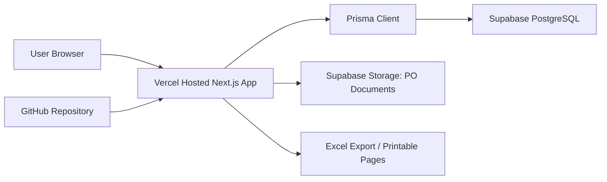

# Describe Environment

Last verified against repository: 19 July 2026

## 1. Tujuan Describe Environment

Dokumen ini menjelaskan lingkungan tempat CV Tajuk Revenue Cycle Information System dijalankan. Fokusnya adalah hubungan antara user, aplikasi web, deployment platform, database, storage, dan batasan lingkungan untuk kebutuhan thesis serta pilot internal terbatas.

## 2. Ringkasan Lingkungan Sistem

Sistem adalah aplikasi web berbasis Next.js yang dapat dijalankan secara lokal untuk demo thesis dan dapat dideploy ke Vercel untuk online demo atau pilot internal terbatas.

Arsitektur saat ini:

```text
User Browser -> Vercel Hosted Next.js App -> Supabase PostgreSQL
                                      -> Supabase Storage for PO documents
```

Repository menggunakan Prisma ORM dengan datasource PostgreSQL. Konfigurasi database dibaca dari environment variables `DATABASE_URL` dan `DIRECT_URL`. Dokumen Customer PO / PO menggunakan Supabase Storage melalui konfigurasi `SUPABASE_URL`, `SUPABASE_SERVICE_ROLE_KEY`, dan `SUPABASE_CUSTOMER_PO_BUCKET`.

## 3. Sumber Bukti Repository

| Evidence | File or Folder | Finding | Confidence |
| --- | --- | --- | --- |
| Tech stack | `package.json` | Next.js, React, TypeScript, Prisma, Supabase client, Tailwind CSS, Vitest, ESLint, ExcelJS. | High |
| Build script | `package.json` | `npm run build` runs `prisma generate && next build`, required for Vercel. | High |
| Next.js output | `next.config.mjs` | Uses default `.next` output directory expected by Vercel. | High |
| Database provider | `prisma/schema.prisma` | Datasource provider is PostgreSQL and uses `DATABASE_URL` plus `DIRECT_URL`. | High |
| Supabase values | `.env.example`, `README.md` | Documents Supabase PostgreSQL, Supabase project URL, service role key, and storage bucket. | High |
| Authentication | `src/lib/auth.ts`, `src/lib/auth-actions.ts`, `src/lib/session.ts` | Demo username/password login and cookie session. | High |
| Role checks | `src/lib/role-access.ts`, action handlers | Manager, Admin, and Sales actions are restricted at capability/action level. | High |
| Audit trail | `src/lib/audit.ts`, `prisma/schema.prisma` | Important business actions are logged to `AuditTrail`. | High |
| Customer PO document storage | `src/lib/customer-po-storage.ts`, Customer PO document route | Customer PO documents are uploaded/downloaded through configured storage. | High |
| Excel export | `src/app/api/sales-orders/export/route.ts` | Sales Order and Customer PO export generates `.xlsx` files. | High |
| Deployment guide | `docs/DEPLOYMENT_GUIDE.md` | Documents Vercel/Supabase environment variables and common deployment errors. | High |

## 4. Technology Architecture

| Architecture Element | Technology | Function | Notes |
| --- | --- | --- | --- |
| User device | Desktop/laptop browser; mobile technically supported | Accesses the web UI. | Responsive UI exists, but business use should be validated with actual users. |
| Web framework | Next.js | Server-rendered pages, server actions, API routes, build/start/dev workflow. | Vercel is the intended cloud host. |
| Runtime | Node.js | Runs Next.js server-side logic, Prisma, Excel export, and storage integration. | Node version is controlled by deployment platform/defaults unless configured. |
| Frontend | React, TypeScript, Tailwind CSS, lucide-react | UI pages, forms, tables, status badges, print views, dashboards. | Operational UI is module-based, not a marketing site. |
| ORM | Prisma Client | Database access layer. | Prisma Client must be generated before build. |
| Database | Supabase PostgreSQL | Stores users, customers, products, inquiries, orders, invoices, payments, delivery notes, customer outreach, and audit trails. | Requires `DATABASE_URL` and `DIRECT_URL`. |
| File storage | Supabase Storage | Stores Customer PO documents. | Requires service role key on server side only. |
| Hosting | Vercel | Builds and deploys the Next.js app from GitHub. | Requires environment variables in Vercel project settings. |
| Source control | GitHub | Stores source code and triggers Vercel deploys. | Current workflow is push to `main`, then Vercel deploy. |
| Testing | Vitest, ESLint | Unit/integration tests and lint checks. | Integration tests require reachable Supabase database. |

## 5. External Systems and Databases

| External System | Owner | Interaction Purpose | Input | Output | Security Notes |
| --- | --- | --- | --- | --- | --- |
| Vercel | Project owner / hosting provider | Hosts the web application. | GitHub source code, environment variables. | Public/preview deployment URL. | Store secrets only in Vercel Environment Variables. |
| Supabase PostgreSQL | Project owner / Supabase | Main operational database. | Prisma queries from server-side app. | Business records and audit trail. | Database password and service role key must not be exposed publicly. |
| Supabase Storage | Project owner / Supabase | Stores Customer PO documents. | Uploaded PO files. | Downloaded PO documents through authenticated routes. | Uses server-only service role key. |
| GitHub | Project owner | Source code storage and deployment trigger. | Commits and pushes. | Vercel build source. | Do not commit `.env` or real secrets. |
| Browser print/PDF | User environment | Prints Invoice and Surat Jalan. | Printable web pages. | Paper or PDF output. | Controlled by browser/OS, not app-specific printer integration. |
| Excel workbook output | User environment | Exports Sales Order/Customer PO report. | Date range and order source. | `.xlsx` file. | Requires authenticated active user. |

No automated integration is currently implemented for bank systems, payment gateways, ERP, courier APIs, WhatsApp, email, accounting journals, or inventory/warehouse stock movement.

## 6. User and Role Environment

| Role | Main Usage | Important Restrictions |
| --- | --- | --- |
| Sales | Customers, Customer Inquiry, Sales Order, Customer PO, and Customer Outreach. | Cannot generate invoices, record payments, create Surat Jalan, create accounts, or approve risky orders. |
| Admin | Invoices, payments, Surat Jalan, receivables, collection, settings/accounts. | Cannot create Sales Orders/Customer Purchase Orders or approve risky orders. |
| Manager | Full monitoring, all operational actions, approval decisions. | Only role that can approve/reject risky Sales Orders. |

The system uses action-level role restrictions. Menus may remain visible across roles for review and demo clarity.

## 7. Communication and Data Flow

```text
User action in browser
  -> HTTPS request to Vercel app
  -> Next.js server action/API route
  -> Prisma Client query/mutation
  -> Supabase PostgreSQL
  -> Response returned to browser
```

PO document flow:

```text
Customer PO form upload
  -> Server-side validation
  -> Supabase Storage bucket
  -> Stored document metadata saved on SalesOrder record
  -> Authenticated download route
```

Export/print flow:

```text
Sales Order/Customer PO export -> ExcelJS workbook -> browser download
Invoice/Surat Jalan print -> printable web page -> browser print dialog
```

## 8. Security Environment

| Security Area | Implemented Control | Limitation or Risk |
| --- | --- | --- |
| Authentication | Username/password checked against `User` table; inactive users rejected. | Demo-oriented; production rollout should review password policy and session design. |
| Password storage | Passwords are hashed before storage. | Production systems normally require adaptive hashing and stricter password management. |
| Session | Cookie-based session. | Production should review secure cookie flags, signing/encryption, expiry, and revocation. |
| Authorization | Role-based action checks for key business actions. | Not full page-level isolation. |
| Secrets | `.env.example` uses placeholders; real secrets should be stored in Vercel/Supabase only. | Any pasted or exposed password should be rotated. |
| Database access | Prisma runs server-side only. | Database credentials must not be exposed to browser code. |
| Storage access | PO document actions are server-side and bucket-based. | Service role key must remain server-only. |
| Audit trail | Major business actions are recorded with actor, role, module, transaction, action, and notes. | No immutable external log storage. |
| Backup | Supabase provides platform-level database tools; app-specific backup procedure is not implemented in repo. | Company pilot should define backup owner, frequency, and restore procedure. |

## 9. Environmental Constraints and Assumptions

### Constraints

| Constraint | Impact |
| --- | --- |
| Thesis project scope | Suitable for demonstration and controlled pilot, not final production ERP. |
| Vercel deployment depends on environment variables | Missing `DATABASE_URL` or `DIRECT_URL` will block build/runtime. |
| Supabase connectivity is required | The deployed app cannot run business flows if Supabase is unavailable or credentials are wrong. |
| No external operational integrations | Bank, payment gateway, courier, ERP, accounting, and email remain manual/out of scope. |
| Demo authentication | Needs hardening before serious production use. |

### Assumptions

| Assumption | Validation Needed |
| --- | --- |
| Company-side users will access through browser. | Confirm device types and internet reliability. |
| Supabase will be accepted as cloud database. | Confirm company data policy and backup expectations. |
| Vercel URL is acceptable for demo/pilot. | Confirm whether custom domain is needed. |
| Demo accounts are enough for thesis/UAT. | Confirm if company needs real named accounts before pilot. |

## 10. Deployment Diagram


```mermaid
flowchart LR
    U["User Browser"] --> V["Vercel Hosted Next.js App"]
    G["GitHub Repository"] --> V
    V --> P["Prisma Client"]
    P --> DB["Supabase PostgreSQL"]
    V --> S["Supabase Storage: PO Documents"]
    V --> X["Excel Export / Printable Pages"]
```

PlantUML source is maintained in `docs/system-design/diagrams/describe-environment-deployment.puml`.

## 11. Location and Network Diagram Decision

A detailed physical location diagram is not included because the repository does not define actual office branches, warehouse network topology, routers, static IPs, VPN, or internal LAN layout.

The logical network model is sufficient for the current thesis project:

```text
Browser over internet -> Vercel -> Supabase
```

If the company moves from pilot to daily operation, a separate deployment/network decision should define domain, HTTPS ownership, user access rules, backup procedure, and data retention.

## 12. Thesis-Ready Summary

Berdasarkan repository terbaru, CV Tajuk Revenue Cycle Information System merupakan aplikasi web berbasis Next.js, TypeScript, Prisma, dan Supabase PostgreSQL yang dapat dijalankan lokal untuk demonstrasi thesis serta dideploy ke Vercel untuk online demo atau pilot internal terbatas. Pengguna dengan role Sales, Admin, dan Manager mengakses sistem melalui browser. Data operasional disimpan di Supabase PostgreSQL, sedangkan dokumen Customer PO disimpan melalui Supabase Storage. Sistem mendukung proses Customer Inquiry, Sales Order, Customer PO, Invoice, Payment, Surat Jalan, Receivable, Collections, Customer Outreach, Dashboard, role-based action control, audit trail, print document, dan Excel export. Sistem belum mencakup integrasi bank, payment gateway, ERP, inventory, accounting journal, courier, email automation, atau production-grade security penuh. Oleh karena itu, sistem layak untuk thesis demonstration dan pilot terbatas, tetapi membutuhkan security hardening, backup procedure, dan keputusan operasional sebelum digunakan sebagai sistem produksi perusahaan.

## 13. Validation Checklist

- [x] Technology stack verified from repository.
- [x] Supabase PostgreSQL provider verified from Prisma schema.
- [x] Vercel build requirements documented.
- [x] Environment variables documented without exposing secrets.
- [x] Role and user environment documented.
- [x] External systems separated from manual business inputs.
- [x] Security controls separated from production recommendations.
- [x] No unsupported bank, ERP, courier, or payment gateway integration was invented.
