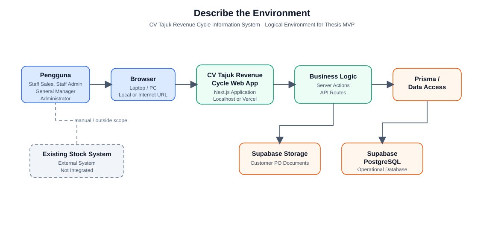

# Describe the Environment

Last verified against repository: 20 July 2026



## 1. Tujuan

Describe the Environment bertujuan menjelaskan lingkungan tempat sistem dijalankan dan digunakan. Dalam tahap system design, bagian ini menunjukkan bagaimana aplikasi berinteraksi dengan pengguna, perangkat kerja, teknologi aplikasi, database, jaringan, file storage, serta sistem lain di sekitar organisasi.

Untuk kebutuhan thesis, dokumentasi ini membantu membatasi ruang lingkup sistem agar sesuai dengan implementasi aktual repository. Fokusnya adalah menjelaskan kondisi environment yang ditemukan pada CV Tajuk Revenue Cycle Information System, bukan merancang arsitektur enterprise baru.

## 2. Gambaran Lingkungan Sistem

CV Tajuk Revenue Cycle Information System adalah aplikasi web berbasis Next.js untuk mendukung proses revenue cycle UMKM, mulai dari customer, product, customer inquiry, sales order/customer PO, invoice, payment, surat jalan, receivable, customer outreach/collections, dashboard, hingga audit trail.

Berdasarkan README dan deployment guide, aplikasi dapat dijalankan secara lokal untuk demonstrasi thesis menggunakan `npm run dev`, kemudian diakses melalui browser pada alamat seperti `http://localhost:3000` atau port lain yang ditampilkan terminal. Repository juga mendukung deployment ke Vercel untuk online demo atau pilot internal terbatas, dengan Supabase PostgreSQL sebagai database dan Supabase Storage untuk dokumen PO Customer PO.

Alur environment utama adalah sebagai berikut:

```text
Pengguna -> Browser -> Next.js Web Application -> Business Logic -> Prisma -> Supabase PostgreSQL
                                                            -> Supabase Storage untuk dokumen PO
```

Repository tidak menunjukkan integrasi langsung dengan sistem stok existing CV Tajuk. README justru menyatakan bahwa inventory management, stock movement, warehouse management, ERP, payment gateway, bank integration, courier tracking, dan automated external API integration berada di luar scope sistem.

## 3. Pengguna dan Perangkat

| Pengguna | Perangkat | Cara mengakses sistem | Fungsi utama yang digunakan |
| --- | --- | --- | --- |
| Staff Sales | Laptop atau PC dengan browser | Localhost saat demo, atau URL Vercel jika aplikasi dideploy | Customer, Product review, Customer Inquiry, Sales Order, Customer PO, Customer Outreach, Dashboard |
| Staff Admin | Laptop atau PC dengan browser | Localhost atau URL aplikasi web | Invoice, Payment, Surat Jalan, Receivable, Collections, Audit Trail review sesuai kebutuhan |
| General Manager | Laptop atau PC dengan browser | Localhost atau URL aplikasi web | Dashboard, monitoring revenue cycle, approval Sales Order berisiko, review audit trail, akses operasional lengkap |
| Administrator | Laptop atau PC dengan browser | Localhost atau URL aplikasi web | Account management, konfigurasi akun demo, invoice/payment/delivery operations, audit trail review |

Perangkat mobile tidak didefinisikan secara khusus dalam repository. Karena aplikasi berbasis web, browser modern pada laptop atau PC menjadi perangkat utama yang paling sesuai untuk demo dan penggunaan operasional awal.

## 4. Technology Environment

| Area | Teknologi yang ditemukan | Keterangan repository |
| --- | --- | --- |
| Frontend | React, Tailwind CSS, lucide-react | Digunakan untuk halaman, form, tabel, dashboard, status badge, dan print view. |
| Backend | Next.js server-side runtime | Server actions, API routes, server-rendered pages, Prisma query, Excel export, dan storage integration berjalan di sisi server. |
| Framework | Next.js 16.2.1 | App Router digunakan pada `src/app`; build script menjalankan `prisma generate && next build`. |
| Programming language | TypeScript | Source utama berada pada `src/app`, `src/components`, dan `src/lib`. |
| ORM | Prisma Client 6.16.0 | Prisma menjadi data access utama dan membaca datasource dari `DATABASE_URL` serta `DIRECT_URL`. |
| Database | Supabase PostgreSQL | Prisma schema menggunakan provider `postgresql`; model mencakup User, AuditTrail, Customer, Product, CustomerInquiry, SalesOrder, Invoice, Payment, CollectionTask, DeliveryNote, dan item terkait. |
| Authentication | Custom application login | Username/password disimpan pada tabel `User`; password diverifikasi dengan bcrypt; session menggunakan signed cookie. Bukan Supabase Auth. |
| File storage | Supabase Storage | Digunakan untuk dokumen PO Customer PO melalui bucket `SUPABASE_CUSTOMER_PO_BUCKET`; file diakses melalui route server yang memeriksa user aktif. |
| Browser | Browser modern | Pengguna mengakses UI, print Invoice/Surat Jalan, dan download export Excel melalui browser. |
| Deployment atau hosting | Localhost dan Vercel | README dan deployment guide mendukung local demo serta deployment Vercel dengan Supabase. Tidak ditemukan konfigurasi LAN khusus. |

Environment variable yang didokumentasikan di `.env.example` dan deployment guide adalah `DATABASE_URL`, `DIRECT_URL`, `AUTH_SECRET`, `SUPABASE_URL`, `SUPABASE_SERVICE_ROLE_KEY`, dan `SUPABASE_CUSTOMER_PO_BUCKET`. Nilai asli secret tidak boleh ditaruh di repository atau diekspos ke browser.

## 5. Network dan External System

Pada mode lokal, aplikasi berjalan melalui localhost pada mesin yang menjalankan development server. Pengguna membuka alamat lokal seperti `http://localhost:3000` dari browser pada perangkat yang sama. Repository tidak mendefinisikan setup LAN, IP statis, router kantor, VPN, atau topologi jaringan internal.

Pada mode deployment, alur yang didokumentasikan adalah:

```text
GitHub repository -> Vercel web app -> Supabase PostgreSQL
                                  -> Supabase Storage
```

Dalam penggunaan deployed/pilot, browser pengguna mengakses aplikasi melalui internet ke Vercel. Aplikasi Next.js kemudian menjalankan business logic server-side dan menghubungi Supabase PostgreSQL melalui Prisma. Untuk dokumen PO Customer PO, aplikasi menggunakan Supabase Storage melalui server-side service role key. Browser tidak berkomunikasi langsung dengan database menggunakan credential Prisma.

External system yang berkaitan berdasarkan repository:

| External system | Status | Keterangan |
| --- | --- | --- |
| Supabase PostgreSQL | Terintegrasi | Database operasional utama aplikasi. |
| Supabase Storage | Terintegrasi terbatas | Penyimpanan dokumen PO Customer PO. |
| Vercel | Didukung untuk deployment | Hosting aplikasi Next.js jika digunakan secara online. |
| GitHub | Didokumentasikan untuk deployment | Source code repository dan trigger deployment ke Vercel. |
| Existing Stock System CV Tajuk | External System - Not Integrated | Tidak ada integrasi stok, inventory, warehouse, atau stock movement pada source code. |
| Bank/payment gateway/courier/ERP/accounting system | Tidak terintegrasi | README menyatakan fitur tersebut berada di luar scope sistem. |

## 6. Security Environment

Login dilakukan melalui halaman `/login`. Sistem mencari user aktif pada tabel `User`, memverifikasi password dengan bcrypt, lalu membuat signed session cookie bernama `cv_tajuk_session`. Session memiliki masa berlaku 8 jam berdasarkan `SESSION_MAX_AGE_SECONDS`.

Role-based access ditemukan pada helper `canRole` dengan role `ADMIN`, `SALES`, dan `MANAGER`. Dalam konteks thesis, role ini dapat dipetakan ke Administrator/Staff Admin, Staff Sales, dan General Manager. Manager memiliki seluruh capability; Sales dapat membuat Sales Order tetapi tidak dapat membuat Invoice, mencatat Payment, membuat Surat Jalan, menghapus Sales Order, atau membuat akun; Admin dapat menangani invoice/payment/delivery/account tetapi tidak membuat Sales Order.

Password protection menggunakan bcrypt dengan rehash untuk hash lama. Session cookie diset sebagai `httpOnly`, `sameSite: "lax"`, dan `secure` pada production. `AUTH_SECRET` wajib tersedia dan minimal 32 karakter agar login dapat berjalan.

Route protection diterapkan melalui `src/proxy.ts`. Semua path selain `/login`, static assets, dan auth endpoint akan diarahkan ke login jika tidak memiliki session valid. Selain itu, server actions sensitif tetap memanggil `requireCurrentUser` dan/atau `canRole`.

Audit trail tersedia melalui model `AuditTrail` dan helper `createAuditTrailLog`. Mutasi bisnis penting mencatat actor, role, module name, entity type, record reference, action, change summary, action note, old value, dan new value. Halaman `/audit-trail` bersifat review/filter; audit record dibuat otomatis oleh sistem.

Environment variable menjadi bagian penting security environment. `DATABASE_URL`, `DIRECT_URL`, `AUTH_SECRET`, `SUPABASE_URL`, `SUPABASE_SERVICE_ROLE_KEY`, dan `SUPABASE_CUSTOMER_PO_BUCKET` harus disimpan di `.env` lokal atau Vercel Environment Variables. Service role key Supabase bersifat server-only dan tidak boleh dibuat sebagai variable `NEXT_PUBLIC_`.

## 7. Batasan Lingkungan

| Batasan | Dampak terhadap penggunaan |
| --- | --- |
| Bergantung pada perangkat yang menjalankan app saat mode lokal | Jika hanya dijalankan di satu laptop demo, user lain tidak dapat mengakses kecuali ada setup sharing jaringan yang tidak didefinisikan di repository. |
| Database menggunakan Supabase PostgreSQL | Aplikasi membutuhkan koneksi internet dan credential database yang benar saat memakai Supabase cloud. |
| Deployment bergantung pada Vercel environment variables | Build atau runtime dapat gagal jika `DATABASE_URL`, `DIRECT_URL`, `AUTH_SECRET`, atau key Supabase belum diatur. |
| File persistence PO bergantung pada Supabase Storage | Dokumen PO Customer PO tersimpan di bucket storage; backup dan retensi file perlu ditentukan secara operasional. |
| Backup belum didefinisikan sebagai fitur aplikasi | Repository tidak menunjukkan prosedur backup/restore khusus aplikasi; perlu kebijakan backup database dan storage sebelum pilot operasional. |
| Tidak ada integrasi eksternal operasional | Stok existing, bank, payment gateway, courier, ERP, dan accounting system tetap manual atau di luar scope. |
| Security masih sesuai kebutuhan proyek tesis/pilot terbatas | README menyatakan belum production-grade authentication dan belum full page-level access isolation. |

## 8. Kesimpulan

Environment aplikasi CV Tajuk Revenue Cycle Information System sesuai untuk kebutuhan thesis dan pilot UMKM terbatas karena sederhana, mudah dijalankan melalui browser, dan tidak membutuhkan arsitektur enterprise. Aplikasi dapat berjalan lokal untuk demonstrasi dan dapat dideploy ke Vercel dengan Supabase PostgreSQL serta Supabase Storage.

Struktur environment yang ditemukan mendukung proses revenue cycle utama tanpa integrasi eksternal kompleks. Hal ini sesuai untuk skala UMKM karena biaya dan kompleksitas teknis tetap rendah. Namun, sebelum digunakan sebagai sistem operasional penuh, CV Tajuk perlu mengonfirmasi perangkat pengguna, model akses internet, kepemilikan deployment, backup database/storage, pengelolaan akun, dan posisi sistem stok existing yang saat ini tidak terintegrasi.
