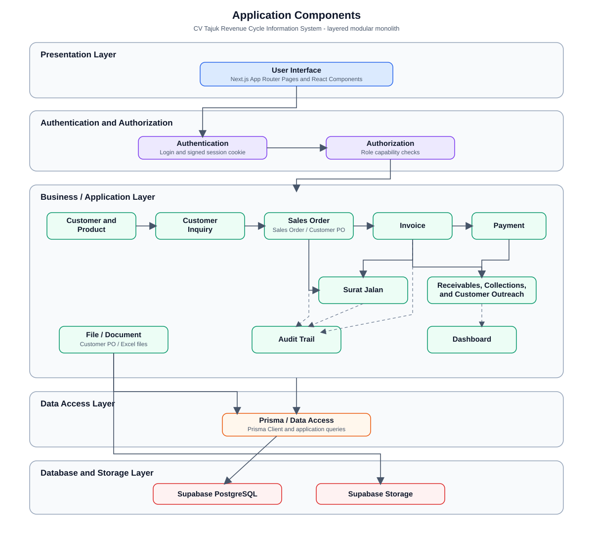

# Design the Application Components

Last verified against repository: 20 July 2026



## 1. Tujuan

Design the Application Components bertujuan menguraikan bagian utama aplikasi dan hubungan antarbagian pada saat sistem dijalankan. Dalam tahap system design, dokumen ini membantu menjelaskan bagaimana kebutuhan bisnis revenue cycle CV Tajuk diterjemahkan menjadi komponen aplikasi yang dapat diimplementasikan, diuji, dan dipelihara.

Berdasarkan konsep Systems Analysis and Design in a Changing World, fokus dokumen ini bukan pada rincian baris kode, melainkan pada pembagian tanggung jawab komponen, aliran data, serta dependency antarkomponen. Dengan demikian, desain komponen dapat digunakan sebagai dasar thesis untuk menunjukkan bahwa aplikasi memiliki struktur yang logis dan sesuai dengan kebutuhan operasional UMKM.

## 2. Gambaran Arsitektur Aplikasi

Aplikasi CV Tajuk Revenue Cycle Information System merupakan satu web application berbasis Next.js, React, TypeScript, Prisma, dan Supabase PostgreSQL. Repository tidak menunjukkan implementasi microservices. Seluruh halaman, server actions, API routes, business logic, komponen React, dan akses database berada dalam satu codebase.

Architectural style yang ditemukan adalah layered modular monolith. Aplikasi dibagi secara sederhana menjadi presentation layer, business/application layer, authentication and authorization, data access layer, serta database/storage layer. Setiap modul bisnis seperti Customer, Product, Customer Inquiry, Sales Order, Customer Purchase Orders, Invoice, Payment, Surat Jalan, Receivable, Collections, Customer Outreach, Dashboard, dan Audit Trail berada dalam aplikasi yang sama, tetapi dipisahkan melalui route, React component, helper business logic, server action, dan model Prisma.

Komunikasi antarkomponen berjalan sebagai berikut:

- User berinteraksi melalui halaman Next.js App Router di `src/app` dan React components di `src/components`.
- Form transaksi memanggil server actions di `src/lib/actions.ts` atau authentication actions di `src/lib/auth-actions.ts`.
- Server actions menjalankan validasi, role check, perhitungan bisnis, pembuatan nomor dokumen, perubahan status, dan pencatatan audit trail.
- Server actions dan server-rendered pages mengakses data melalui Prisma Client di `src/lib/prisma.ts`.
- Prisma membaca dan menulis data ke Supabase PostgreSQL sesuai model pada `prisma/schema.prisma`.
- Dokumen customer PO disimpan melalui Supabase Storage menggunakan `src/lib/customer-po-storage.ts`, sedangkan metadata dokumen tetap disimpan pada model `SalesOrder`.

## 3. Application Layers

| Layer | Temuan implementasi | Lokasi utama |
| --- | --- | --- |
| Presentation Layer | Halaman App Router, form, tabel, dashboard, print view, status badge, process tabs, dan dialog export. Layer ini menangani interaksi user dan penyajian data. | `src/app`, `src/components` |
| Business/Application Layer | Server actions dan helper domain untuk membuat, mengubah, menghapus, menghitung, mengonversi, dan memperbarui status transaksi. | `src/lib/actions.ts`, `src/lib/workflow.ts`, `src/lib/calculations.ts`, `src/lib/process-status.ts` |
| Authentication and Authorization | Login berbasis username/password, password hashing, signed session cookie, session validation, route protection, dan capability check berdasarkan role ADMIN, SALES, MANAGER. | `src/lib/auth.ts`, `src/lib/auth-actions.ts`, `src/lib/session.ts`, `src/lib/session-token.ts`, `src/lib/role-access.ts`, `src/proxy.ts` |
| Data Access Layer | Prisma Client digunakan oleh pages, API routes, dan server actions untuk query database. Tidak ditemukan repository pattern terpisah; akses data terpusat secara praktis melalui Prisma Client. | `src/lib/prisma.ts`, query Prisma di `src/app` dan `src/lib` |
| Database Layer | Supabase PostgreSQL menyimpan master data, transaksi revenue cycle, user, dan audit trail. | `prisma/schema.prisma`, `prisma/migrations` |
| Storage Layer | Supabase Storage digunakan secara terbatas untuk upload, download, dan delete dokumen customer PO. | `src/lib/customer-po-storage.ts`, `src/app/api/customer-purchase-orders/[salesOrderId]/document/route.ts` |

## 4. Application Components

| Component | Fungsi utama | Pengguna terkait | Data yang digunakan | Dependency utama | Lokasi source code |
| --- | --- | --- | --- | --- | --- |
| Authentication | Memproses login, logout, validasi password, dan pembuatan session cookie. | Admin, Sales, Manager | `User`, session cookie | bcryptjs, signed session token, Prisma | `src/app/login/page.tsx`, `src/lib/auth.ts`, `src/lib/auth-actions.ts`, `src/lib/session.ts`, `src/proxy.ts` |
| User and Role Management | Mengelola akun demo/lokal dan membatasi aksi berdasarkan role/capability. | Admin, Manager | `User`, `UserRole`, `UserStatus` | `canRole`, `RestrictedAction`, audit trail | `src/app/settings/page.tsx`, `src/lib/role-access.ts`, `src/lib/auth-actions.ts`, `src/components/restricted-action.tsx` |
| Customer | Mengelola master customer dan menampilkan histori sales order, invoice, payment risk, serta kategori customer. | Sales, Manager, Admin | `Customer`, `SalesOrder`, `Invoice`, `Payment` | server actions, customer intelligence, Prisma | `src/app/customers/page.tsx`, `src/lib/customer-intelligence.ts`, `src/lib/customer-status.ts`, `src/lib/actions.ts` |
| Product | Mengelola master product, status product, List Price, dan data produk untuk inquiry/order item. | Sales, Manager, Admin | `Product`, `SalesOrderItem`, `CustomerInquiryItem` | server actions, product insight, Prisma | `src/app/products/page.tsx`, `src/lib/product-insights.ts`, `src/lib/actions.ts` |
| Customer Inquiry | Mencatat permintaan customer, item yang diminta, status inquiry, dan konversi ke Sales Order atau Customer PO. | Sales, Manager | `CustomerInquiry`, `CustomerInquiryItem`, `Customer`, `Product`, `SalesOrder` | inquiry form, inquiry lifecycle, server actions | `src/app/customer-inquiries/page.tsx`, `src/app/customer-inquiries/[inquiryId]/page.tsx`, `src/components/customer-inquiry-form.tsx`, `src/lib/customer-inquiry.ts`, `src/lib/customer-inquiry-lifecycle.ts` |
| Sales Order | Membuat dan memonitor Sales Order/Customer PO, item transaksi, pricing, approval risk, invoice generation, deletion, dan export. | Sales, Manager, Admin sesuai aksi | `SalesOrder`, `SalesOrderItem`, `Customer`, `Product`, `Invoice`, `DeliveryNote` | workflow, calculations, approval, deletion, ExcelJS export | `src/app/sales-orders/page.tsx`, `src/app/sales-orders/[salesOrderId]/page.tsx`, `src/app/customer-purchase-orders/page.tsx`, `src/lib/actions.ts`, `src/lib/sales-order-approval.ts`, `src/app/api/sales-orders/export/route.ts` |
| Invoice | Menampilkan invoice dari Sales Order, due date, payment terms, status pembayaran, print invoice, dan catatan invoice. | Admin, Manager, Sales untuk review | `Invoice`, `SalesOrder`, `Customer`, `Payment` | workflow overdue sync, calculations, print page | `src/app/invoices/page.tsx`, `src/app/invoices/[invoiceId]/print/page.tsx`, `src/lib/actions.ts`, `src/lib/workflow.ts` |
| Payment | Mencatat pembayaran terhadap invoice terbuka dan memperbarui paid amount, remaining amount, serta status invoice/receivable. | Admin, Manager | `Payment`, `Invoice`, `Customer` | payment form, calculations, role access, audit trail | `src/app/payments/page.tsx`, `src/components/payment-form.tsx`, `src/lib/actions.ts`, `src/lib/calculations.ts` |
| Surat Jalan | Membuat delivery note berdasarkan invoice atau sales order, mengelola status pengiriman, item pengiriman, dan print surat jalan. | Admin, Manager | `DeliveryNote`, `DeliveryNoteItem`, `Invoice`, `SalesOrder`, `Customer` | delivery note form, delivery eligibility, audit trail | `src/app/surat-jalan/page.tsx`, `src/app/surat-jalan/[deliveryNoteId]/print/page.tsx`, `src/components/delivery-note-form.tsx`, `src/lib/actions.ts` |
| Receivable | Memonitor piutang aktif dan selesai berdasarkan invoice, remaining amount, due date, dan status overdue. | Admin, Manager, Sales untuk review | `Invoice`, `Customer`, `SalesOrder`, `Payment` | overdue sync, process status, collection link | `src/app/receivables/page.tsx`, `src/lib/process-status.ts`, `src/lib/workflow.ts` |
| Collections | Menjadwalkan dan mencatat pekerjaan penagihan pembayaran. Terhubung dengan customer dan opsional invoice. | Sales, Admin, Manager | `CollectionTask`, `Customer`, `Invoice` | `createCollectionTask`, collection notifications | `src/app/collections/page.tsx`, `src/lib/actions.ts`, `src/lib/notifications.ts` |
| Customer Outreach | Mencatat kontak pelanggan mengenai produk. | Sales, Admin, Manager | `CustomerOutreach`, `Customer` | `recordCustomerOutreach`, outreach notifications | `src/app/customer-outreach/page.tsx`, `src/lib/actions.ts`, `src/lib/notifications.ts` |
| Dashboard | Menyajikan KPI, revenue trend, komposisi pembayaran/piutang, status order/invoice, popular products, collection reminders, dan insight role-based. | Admin, Sales, Manager | `Invoice`, `SalesOrder`, `Payment`, `Customer`, `DeliveryNote`, `CollectionTask`, `SalesOrderItem` | Prisma query, calculations, customer/product insights | `src/app/page.tsx`, `src/app/dashboard/page.tsx`, `src/components/sales-customer-insights.tsx`, `src/components/stat-card.tsx` |
| Audit Trail | Mencatat perubahan penting secara otomatis dan menyediakan halaman review/filter. Audit trail bersifat read-only dari UI. | Admin, Manager | `AuditTrail`, actor dari session user | `createAuditTrailLog`, Prisma, format helpers | `src/app/audit-trail/page.tsx`, `src/lib/audit.ts`, pemanggilan audit di `src/lib/actions.ts` |
| File atau Document Management | Mengelola dokumen customer PO melalui Supabase Storage dan ekspor Excel Sales Order/Customer PO. Bukan document management system penuh. | Sales, Manager, Admin sesuai akses | Metadata dokumen di `SalesOrder`, file customer PO di Supabase Storage | Supabase Storage, ExcelJS, API routes | `src/lib/customer-po-storage.ts`, `src/app/api/customer-purchase-orders/[salesOrderId]/document/route.ts`, `src/app/api/sales-orders/export/route.ts`, `src/components/sales-order-export-dialog.tsx` |
| Data Access | Menyediakan Prisma Client untuk query database dari pages, server actions, helper, dan API routes. | Komponen internal aplikasi | Semua model Prisma | `@prisma/client` | `src/lib/prisma.ts` |
| Database | Menyimpan struktur data utama aplikasi revenue cycle, termasuk master, transaksi, user, dan audit. | Komponen internal aplikasi | `User`, `AuditTrail`, `Customer`, `Product`, `CustomerInquiry`, `SalesOrder`, `Invoice`, `Payment`, `CollectionTask`, `DeliveryNote` | Supabase PostgreSQL, Prisma migrations | `prisma/schema.prisma`, `prisma/migrations` |

## 5. Hubungan Antarcomponent

Alur utama aplikasi mengikuti revenue cycle sederhana:

```text
Customer Inquiry
-> Sales Order / Customer PO
-> Invoice
-> Payment
-> Receivable
-> Collections and Customer Outreach
```

Customer dan Product menjadi master data yang dipakai pada Customer Inquiry dan Sales Order. Pada Customer Inquiry, user dapat mencatat kebutuhan customer beserta item dan harga yang diminta/disepakati. Inquiry yang masih open dapat dikonversi menjadi Sales Order atau Customer PO. Relasi ini terlihat pada model `CustomerInquiry.salesOrderId` dan proses konversi pada `createSalesOrder`.

Sales Order menjadi pusat transaksi penjualan. Komponen ini menggunakan data Customer dan Product, menghitung subtotal/total, mengatur payment terms IMMEDIATE atau CREDIT, serta menentukan apakah order membutuhkan approval Manager. Setelah order memenuhi kondisi, Admin atau Manager dapat membuat Invoice dari Sales Order melalui action `generateInvoice`.

Invoice berhubungan langsung dengan Payment dan Receivable. Payment yang dicatat melalui `recordPayment` akan membuat record `Payment`, memperbarui `Invoice.paidAmount`, `Invoice.remainingAmount`, dan `Invoice.status`, lalu mencatat perubahan Receivable pada audit trail. Receivable bukan model database terpisah; secara implementasi, piutang dihitung dari data Invoice yang masih memiliki remaining amount.

Sales Order dan Surat Jalan berhubungan melalui `DeliveryNote.salesOrderId`. Surat Jalan juga dapat dibuat dari Invoice melalui `DeliveryNote.invoiceId`. Untuk transaksi IMMEDIATE, aplikasi memeriksa apakah invoice sudah layak dibuatkan Surat Jalan; untuk CREDIT, dokumen delivery dapat dibuat sesuai aturan eligibility yang ada di `canCreateDeliveryNoteForInvoice`. Ketika Surat Jalan berstatus Delivered, helper lifecycle dapat menyelesaikan Customer Inquiry yang terhubung dengan order tersebut.

Audit Trail terhubung dengan hampir semua modul bisnis utama. Server actions untuk Customer, Product, Customer Inquiry, Sales Order, Invoice, Payment, Receivable, Collections, Customer Outreach, dan Surat Jalan memanggil `createAuditTrailLog` untuk menyimpan actor, module name, entity type, record reference, action, old value, new value, dan action note. Dengan demikian, audit trail menjadi komponen lintas modul yang merekam perubahan bisnis penting.

Dashboard membaca data operasional dari Sales Order, Invoice, Payment, Delivery Note, CollectionTask, CustomerOutreach, Customer, dan Sales Order Item. Data tersebut diringkas menjadi KPI, distribusi status, revenue trend, outstanding receivables, collection reminders, dan insight customer/product. Dashboard tidak menyimpan data agregasi sendiri; dashboard menghitung tampilan dari data operasional yang tersedia saat halaman dibuka.

## 6. Component Design Summary

Struktur komponen aplikasi cukup sesuai untuk skala UMKM CV Tajuk karena sederhana, langsung mengikuti proses bisnis revenue cycle, dan tidak menambah kompleksitas microservices. Layered modular monolith memudahkan pengembangan thesis MVP: UI, proses bisnis, akses data, database, dan audit trail masih berada dalam satu repository, tetapi tanggung jawabnya tetap dapat dijelaskan secara terpisah.

Keunggulan struktur saat ini adalah alur transaksi yang mudah dipahami, integrasi audit trail pada action bisnis penting, role-based access pada aksi sensitif, serta penggunaan Prisma schema sebagai sumber utama struktur data. Untuk konteks UMKM, pendekatan ini membantu menjaga biaya pemeliharaan tetap rendah dan membuat proses operasional seperti inquiry, order, invoice, payment, delivery, receivable, dan customer outreach dapat dilacak dari satu aplikasi.

Rekomendasi perbaikan sederhana:

1. Tambahkan ringkasan dependency per modul pada README atau dokumentasi system design agar perubahan future maintenance lebih mudah ditelusuri.
2. Pertimbangkan pemisahan file `src/lib/actions.ts` menjadi beberapa file server action per domain ketika jumlah action terus bertambah, misalnya customer actions, sales order actions, invoice/payment actions, dan delivery actions.
3. Tambahkan test terfokus untuk alur end-to-end kritis, khususnya Customer Inquiry ke Sales Order, Sales Order ke Invoice, Payment ke Receivable, dan Surat Jalan ke completion inquiry.
4. Dokumentasikan matriks role dan capability dalam satu tabel singkat yang selalu diselaraskan dengan `src/lib/role-access.ts`.
5. Tambahkan catatan operasional untuk backup database dan storage dokumen PO karena data transaksi dan dokumen pelanggan menjadi aset penting UMKM.
